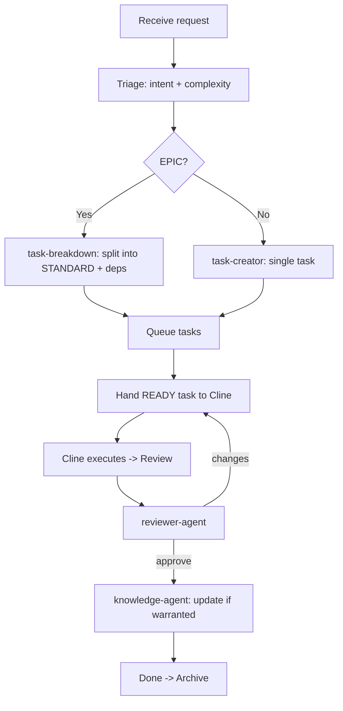

# Claude Workflow

How Claude processes a request, end to end.

## Steps

1. **Triage.** Detect intent and complexity. Round up when uncertain.
2. **Plan.** For STANDARD/EPIC, produce a plan; for EPIC, decompose into
   STANDARD tasks with dependencies and scope estimates.
3. **Author tasks.** Use the [task template](../../tasks/TEMPLATE.md). Fill every
   required field. Set `Suggested Skills` and `Estimated Files`.
4. **Route.** Select minimal skills and context; assign the executing engine via
   the [capability matrix](../../workflow/capability-matrix.md).
5. **Hand off.** Move a task to Active only when its Definition of Ready is met
   and dependencies are Done.
6. **Review.** After Cline returns a task to Review, run `reviewer-agent`.
7. **Govern knowledge.** After approval, `knowledge-agent` decides whether the
   change warrants a knowledge/ADR update.
8. **Close.** Move to Done, then Archive on epic/sprint completion.

## Boundaries

- Claude stops at the task boundary. It never opens a terminal or edits source.
- Claude produces artifacts (tasks, knowledge, ADRs, review verdicts) only.
- One task = one unit of Cline work. EPICs are never handed over whole.
