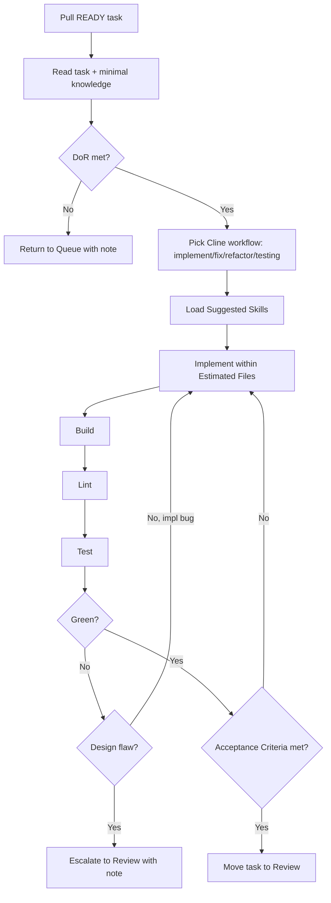

# Cline Workflow

How Cline processes one task from Active to Review.

## Steps

1. **Pull** a task whose Definition of Ready is met and dependencies are Done.
2. **Read** the task and only the knowledge/skills it lists. Minimise context.
3. **Choose the workflow**: [implement](../cline/workflows/implement.md),
   [fix](../cline/workflows/fix.md), [refactor](../cline/workflows/refactor.md),
   [testing](../cline/workflows/testing.md), or
   [review-fixes](../cline/workflows/review-fixes.md).
4. **Implement** strictly within `Estimated Files` and Requirements.
5. **Verify**: build → lint → test. Iterate on implementation bugs.
6. **Escalate** if a stop condition hits (design decision, ADR/convention
   change, scope growth, design flaw). Return the task with a note.
7. **Complete**: when Definition of Done holds, move the task to Review.

## Boundaries

- One task at a time. No cross-task scope bleed.
- No architecture, convention, knowledge, or ADR edits.
- No scope expansion — Out of Scope is binding.
