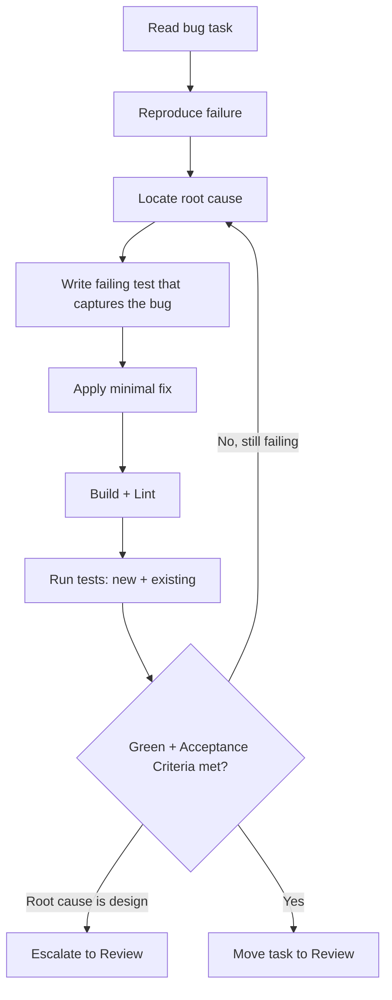

# Workflow: fix

Resolve a defect defined by a TRIVIAL, SIMPLE, or STANDARD bug task.

## When The Router Selects It

Intent = `fix`. The task describes wrong behaviour to correct.

## Execution Flow

## Steps

1. **Read** the task; note the reported symptom and Acceptance Criteria.
2. **Reproduce** the failure (test, script, or manual step per the task).
3. **Find the root cause** — fix the cause, not the symptom.
4. **Capture it**: add a failing test that would have caught the bug
   (use the `debugging` and `testing` skills).
5. **Fix minimally**: the smallest change that makes the test pass.
6. **Verify**: build, lint, and run the whole suite to check for regressions.
7. **Escalate** if the true fix requires an architecture or convention change.
8. **Complete**: move the task to Review with the new test in place.

## Guardrails

- No opportunistic refactors while fixing — file a separate task.
- The regression test is part of Definition of Done for a fix.
