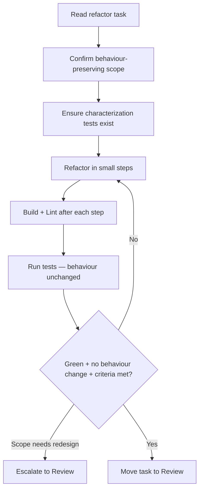

# Workflow: refactor

Improve internal structure **without changing external behaviour**, as defined
by a refactor task.

## When The Router Selects It

Intent = `refactor`. The task specifies what to restructure and the invariants
to preserve.

## Execution Flow

## Steps

1. **Read** the task; identify the target and the **invariants** that must not
   change (public APIs, outputs, side effects).
2. **Safety net**: confirm tests cover current behaviour; if gaps exist and the
   task allows, add characterization tests first (`testing` skill).
3. **Refactor in small, verified steps** (`performance`, `typescript`, or
   relevant skills). Never mix a behaviour change into a refactor.
4. **Verify after each step**: build, lint, run tests. Behaviour must stay
   identical.
5. **Escalate** if the "refactor" actually requires a design change or new ADR —
   that is a Planning-Runtime decision.
6. **Complete**: move the task to Review.

## Guardrails

- A refactor that changes behaviour is out of scope by definition.
- No new features. No convention changes.
