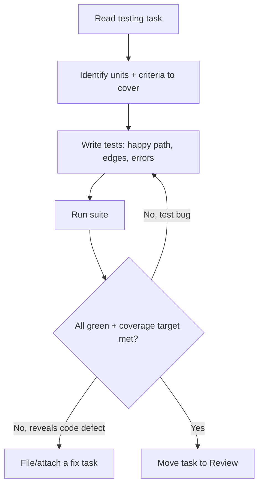

# Workflow: testing

Add or strengthen tests for existing or new code, as defined by a testing task.

## When The Router Selects It

Intent = `feature`/`fix` with a testing-focused task, or an explicit
"increase coverage / add tests" task.

## Execution Flow

## Steps

1. **Read** the task; identify the units and the Acceptance Criteria that define
   "adequately tested".
2. **Design cases** with the `testing` skill: happy path, boundaries, error
   handling, and state transitions.
3. **Write tests** following the project's test conventions
   (`coding-conventions.md`).
4. **Run** the suite; ensure new tests pass and nothing regresses.
5. **If a test uncovers a real defect**, do not silently patch scope — surface
   it: attach a note and, per Router, spin a `fix` task.
6. **Complete**: move the task to Review when the coverage/criteria target is
   met.

## Guardrails

- Tests assert real behaviour, not implementation trivia.
- Meeting a coverage number by testing nothing meaningful fails review.
