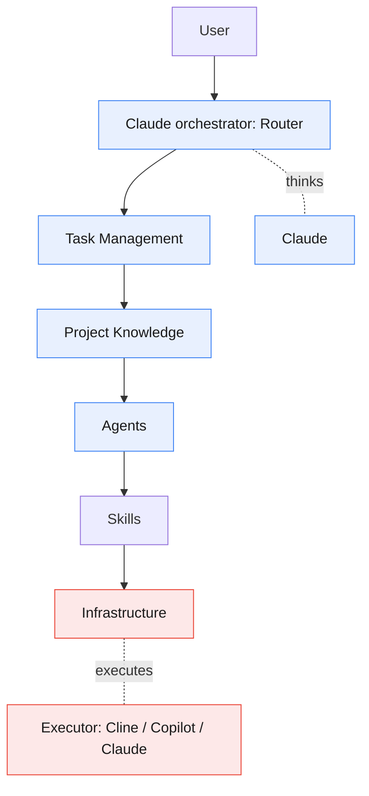
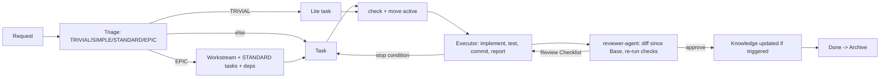

# Strix

**A task-driven, hybrid AI coding workflow — packaged as a Claude Code plugin.**

Strix separates *thinking* from *doing*. **Claude** plans, designs, reviews, and
governs knowledge (the Planning Runtime). A **selectable executor** — **Cline**,
**GitHub Copilot**, or **Claude** — implements, builds, lints, tests, and fixes
(the Execution Runtime). You choose the executor per project at init. A single
Claude orchestrator runs the Router and decides everything; agents never self-select. The result is
small prompts, reusable context, auditable changes, and a knowledge base that
stays coherent over time.

> **Claude Thinks; the executor executes. Never blur the two.**

## Why Strix

- **Task-Driven** — nothing runs without a task; every change traces to one.
- **Hybrid + Layered** — two runtimes, one responsibility each.
- **Router-Based** — one decider; capability-matrix dispatch, not hard-coded engines.
- **Skill-First** — reusable skills carry the how-to; prompts stay small.
- **Knowledge-Driven** — a governed source of truth; no drift.
- **Anti-Over-Engineering** — Out of Scope + Estimated Files fence every task.
- **Future-Proof** — add an engine by editing the capability matrix, not the code.

## Install & Adopt

Strix ships as a single Claude Code plugin. The framework (agents, skills,
rules, workflows, hooks) installs once; each project gets a small, per-project
`.strix/` data folder plus the **chosen executor's** config seeded on init.

```sh
# 1. Add this repo as a marketplace (it self-hosts .claude-plugin/marketplace.json)
claude plugin marketplace add <this-repo-url-or-path>

# 2. Install the plugin
claude plugin install strix

# 3. In the project you want Strix to manage, initialize it
/strix:init            # asks which executor, then seeds .strix/ + that executor's config

# 4. Populate the knowledge base from the real codebase (one time)
#    Run the project-scan skill; it fills .strix/knowledge/* + an adoption ADR.
```

`/strix:init` asks which executor to use (**Cline** → `.clinerules/`, **GitHub
Copilot** → `.github/`, **Claude** → an isolated `strix-executor` subagent +
`.strix/executor/`) and records the choice in `.strix/config.yaml`. It is
idempotent — existing seed files are preserved. Pass `--force-executor` to switch
executors or refresh the executor's files (the old executor's files are listed,
never deleted), or `--force` to refresh every plugin-owned seed file. Neither flag
overwrites project state: `.strix/knowledge/**`, the workstream registry, and the
executor's skill catalog are only written when missing, and a file you already had
where an executor's config goes is kept and flagged rather than replaced. You can also run the
scaffolder directly: `bin/strix-init --executor <cline|copilot|claude>`.

The board is managed through `.strix/bin/strix-task`, a small shim that is safe
to commit: it finds the plugin at run time (`STRIX_PLUGIN_ROOT`, then the plugin's
`bin/` on Claude Code's `PATH`, then the gitignored `.strix/local.yaml` that
`strix-init` and the SessionStart hook keep current, then the plugin cache). Set
`STRIX_PLUGIN_ROOT` where none of those exist, such as CI. The CLI needs Node 22
or newer.

### How the board keeps everyone honest

- `strix-task move` enforces the lifecycle: a task goes active only when it is
  ready (no template placeholders, Definition of Ready ticked, dependencies
  Done), and goes to review only with an Execution Report. Every move is logged
  in the task's History; `--override "<reason>"` is the recorded exception.
- The executor commits with a `Strix-Task: <ID>` trailer, and `strix-task diff <ID>`
  shows the reviewer exactly those commits since the task's Base. The reviewer
  re-runs the reported checks instead of trusting them.
- TRIVIAL changes use a lite task (`strix-task new --lite`) and skip the reviewer.
- In Claude Code, a PreToolUse hook denies the `strix-executor` subagent any edit
  under `.strix/` or any board move but review/queue, and asks before the planning
  session edits project files. It is a guardrail, not a security boundary.
- Strix never commits `.strix/`; commit board changes with your normal workflow.

### How activation works

The plugin's **SessionStart hook is guarded**: it injects the Strix operating
contract *only* when the current project has a `.strix/` directory. In every
other project it stays silent, so the globally-installed plugin never pollutes
unrelated work. Creating `.strix/` (via `/strix:init`) is the single switch that
turns Strix on for a project — no project `CLAUDE.md` edit required. Your
project keeps its own `CLAUDE.md` for its own instructions; Strix's contract
arrives separately through the hook.

## Architecture at a Glance



Full picture: [reference/docs/architecture.md](reference/docs/architecture.md).

## The Flow



A lite task skips `reviewer-agent`: the orchestrator checks its diff and moves it
to Done.

## Repository Structure (the plugin source)

<!-- strix:gen start id=readme-tree -->
```text
strix/
├── agents/          # 4 Claude agents: triage, task-creator, reviewer, knowledge
├── bin/             # strix-init (scaffolder) and strix-task (board CLI, runs strix-task.mjs)
├── .claude-plugin/  # plugin.json + marketplace.json (versions synced by `npm run gen`)
├── commands/        # slash commands (/strix:init)
├── config/          # YAML source of truth + JSON Schemas; docs are generated from it
├── docs/            # design specs for the plugin itself (not shipped)
├── .github/         # CI: validate, test, and the generated-docs drift gate
├── hooks/           # SessionStart contract (strix-context) + PreToolUse guard (strix-guard)
├── lib/             # shell helpers shared by strix-init and the hooks
├── reference/       # framework docs: docs/, workflow/, rules/, examples/
├── scripts/         # validate, gen, and the test suites (not shipped)
├── skills/          # 11 reasoning skills + strix-init (one SKILL.md each)
└── templates/       # seed content: strix/ → .strix/; executors/<id>/ → executor config
```
<!-- strix:gen end id=readme-tree -->

Per-project footprint after `/strix:init` (executor = Cline shown; Copilot seeds
`.github/`, Claude seeds `.claude/agents/strix-executor.md` + `.strix/executor/`):

```text
<project>/
├── .strix/
│   ├── config.yaml                 # records the chosen executor (commit it)
│   ├── bin/strix-task              # board CLI shim; holds no machine path (commit it)
│   ├── local.yaml                  # this machine's plugin path (gitignored)
│   ├── knowledge/ (project-context, coding-conventions, architecture, glossary, decisions/)
│   └── tasks/ (workstreams.yaml, TEMPLATE.md, queue active review done archive)
└── .clinerules/                    # generated from templates/executors/_shared, seeded on init
    ├── *.md                        #   rules
    ├── workflows/                  #   execution workflows
    └── skills/                     #   implementation skills
```

All skills, agents, and the copied executor config read/write one shared,
engine-agnostic data directory: `.strix/knowledge/…` and `.strix/tasks/…`.

## Runtime Responsibilities

| | Claude (Planning) | Executor (Execution) |
|---|---|---|
| **Owns** | analyze, brainstorm, triage, plan, architect, break down, review, govern | implement, edit, refactor, terminal, build, lint, test, fix |
| **Never** | write code, commit, build/lint/test to produce a change (may inspect state and re-run reported checks) | redesign, change conventions/knowledge/ADRs, edit `.strix/`, expand scope |

Authoritative split: [reference/workflow/capability-matrix.md](reference/workflow/capability-matrix.md).

## Start Here

- New to Strix? → [reference/docs/architecture.md](reference/docs/architecture.md)
- Want the flow? → [reference/docs/workflow.md](reference/docs/workflow.md)
- Writing tasks? → the seeded `.strix/tasks/TEMPLATE.md` (template: [templates/strix/tasks/TEMPLATE.md](templates/strix/tasks/TEMPLATE.md))
- Driving the board? → [reference/workflow/task-lifecycle.md](reference/workflow/task-lifecycle.md) and `strix-task --help`
- How routing works? → [reference/workflow/router.md](reference/workflow/router.md)
- Changing config or executor rules? → [config/README.md](config/README.md)
- Extending it? → [reference/docs/contribution-guide.md](reference/docs/contribution-guide.md)
- All docs → [reference/docs/README.md](reference/docs/README.md)

## Releases

Changes and upgrade notes: [CHANGELOG.md](CHANGELOG.md).

## Status

Framework packaged as a plugin. The seeded knowledge files
(`project-context.md`, `coding-conventions.md`, `architecture.md`,
`glossary.md`) start as templates. After `/strix:init`, run the `project-scan`
skill once to populate `.strix/knowledge/*` from the actual codebase — the
`knowledge-agent` reads the repo (stack, structure, conventions, architecture)
and fills the templates plus an adoption ADR. Thereafter the
[governance policy](reference/docs/governance.md) keeps them current.
