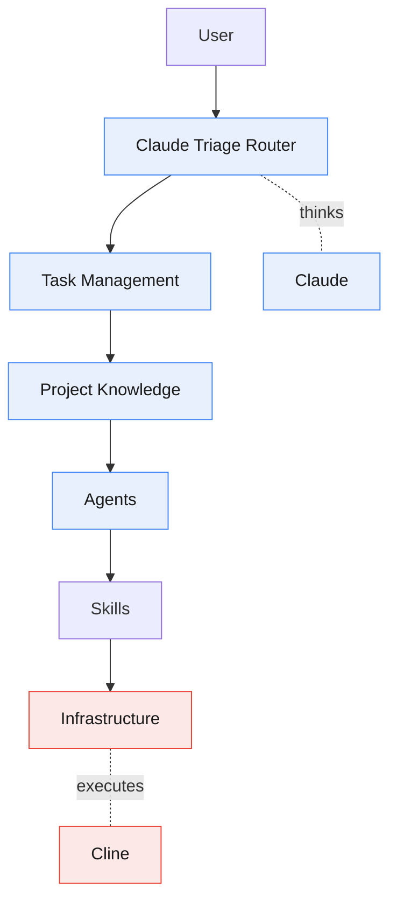
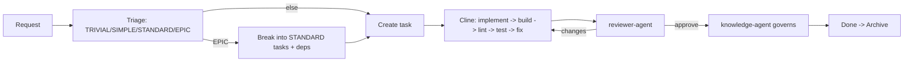

# Strix

**A task-driven, hybrid AI coding workflow framework.**

Strix separates *thinking* from *doing*. **Claude** plans, designs, reviews, and
governs knowledge. **Cline** implements, builds, lints, tests, and fixes. A
single Claude Triage Router decides everything; agents never self-select. The
result is small prompts, reusable context, auditable changes, and a knowledge
base that stays coherent over time.

> **Claude Thinks. Cline Executes. Never blur the two.**

## Why Strix

- **Task-Driven** — nothing runs without a task; every change traces to one.
- **Hybrid + Layered** — two runtimes, seven layers, one responsibility each.
- **Router-Based** — one decider; capability-matrix dispatch, not hard-coded engines.
- **Skill-First** — reusable skills carry the how-to; prompts stay small.
- **Knowledge-Driven** — a governed source of truth; no drift.
- **Anti-Over-Engineering** — Out of Scope + Estimated Files fence every task.
- **Future-Proof** — add an engine by editing the capability matrix, not the code.

## Architecture at a Glance



Full picture: [docs/architecture.md](docs/architecture.md).

## The Flow



## Repository Structure

```text
strix/
├── README.md                     # you are here
├── CLAUDE.md                     # Claude's bootstrap — loaded first every session
├── .clinerules/                  # Cline's bootstrap — identity, workflow, permissions, execution, coding
│   └── workflows/                # implement, fix, refactor, testing, review-fixes
├── workflow/                     # engine-agnostic core
│   ├── README.md                 # principles + 7 layers + flow
│   ├── runtime-separation.md     # Claude vs Cline boundary
│   ├── runtimes/
│   │   ├── planning-runtime.md   # Claude: reasoning
│   │   └── execution-runtime.md  # Cline: implementation
│   ├── complexity-levels.md      # TRIVIAL/SIMPLE/STANDARD/EPIC
│   ├── task-driven-workflow.md   # every request -> task
│   ├── task-lifecycle.md         # Queue->Active->Review->Done->Archive
│   ├── capability-matrix.md      # capabilities -> engines (no hard-coding)
│   └── router.md                 # the five routing functions
├── .claude/                      # Planning Runtime config
│   ├── rules/                    # identity, workflow, permissions, routing, knowledge
│   ├── agents/                   # triage, task-creator, reviewer, knowledge
│   └── skills/                   # 10 reasoning skills (5 files each)
├── .agents/                      # Execution Runtime config (catalog only)
├── .cline/
│   └── skills/                   # implementation skills (SKILL.md each) — none yet
├── knowledge/                    # source of truth (Claude R/W, Cline R)
│   ├── project-context.md
│   ├── coding-conventions.md
│   ├── architecture.md
│   ├── glossary.md
│   └── decisions/                # ADRs + template
├── tasks/                        # the board
│   ├── TEMPLATE.md
│   └── queue/ active/ review/ done/ archive/
└── docs/                         # documentation set (11 docs)
```

## Runtime Responsibilities

| | Claude (Planning) | Cline (Execution) |
|---|---|---|
| **Owns** | analyze, brainstorm, triage, plan, architect, break down, review, govern | implement, edit, refactor, terminal, build, lint, test, fix |
| **Never** | write code, run terminal, build, lint, test | redesign, change conventions/knowledge/ADRs, expand scope |

Authoritative split: [workflow/capability-matrix.md](workflow/capability-matrix.md).

## Engine Entry Points

Each engine bootstraps from its own contract, loaded before any work:

- **Claude** → [CLAUDE.md](CLAUDE.md) (auto-loaded at session start).
- **Cline** → [.clinerules/](.clinerules/) at the repo root, where Cline
  auto-loads its rules.

## Start Here

- New to Strix? → [docs/architecture.md](docs/architecture.md)
- Want the flow? → [docs/workflow.md](docs/workflow.md)
- Writing tasks? → [tasks/TEMPLATE.md](tasks/TEMPLATE.md)
- Extending it? → [docs/contribution-guide.md](docs/contribution-guide.md)
- All docs → [docs/README.md](docs/README.md)

## Status

Framework scaffold. Knowledge files (`project-context.md`,
`coding-conventions.md`, `architecture.md`, `glossary.md`) are templates to fill
when Strix is adopted by a real project.
