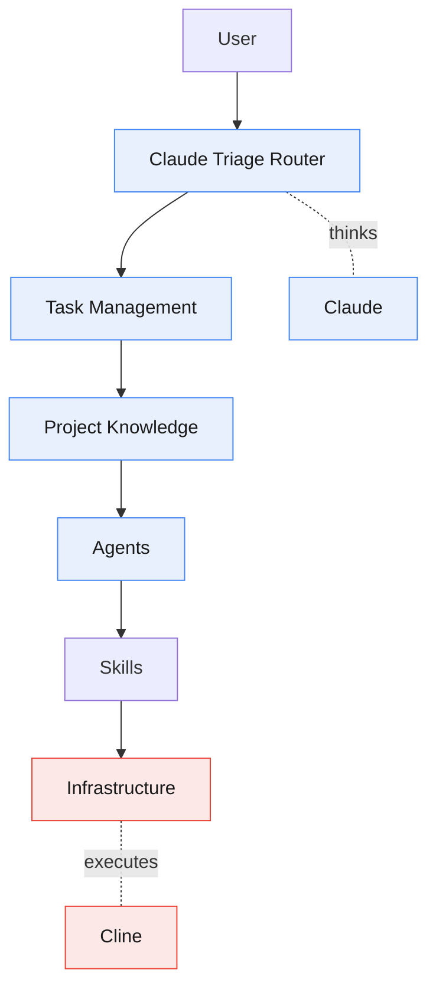
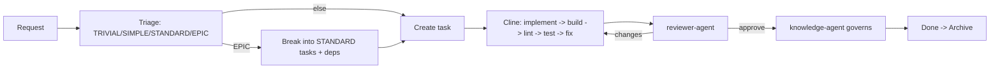

# Strix

**A task-driven, hybrid AI coding workflow — packaged as a Claude Code plugin.**

Strix separates *thinking* from *doing*. **Claude** plans, designs, reviews, and
governs knowledge (the Planning Runtime). **Cline** implements, builds, lints,
tests, and fixes (the Execution Runtime). A single Claude Triage Router decides
everything; agents never self-select. The result is small prompts, reusable
context, auditable changes, and a knowledge base that stays coherent over time.

> **Claude Thinks. Cline Executes. Never blur the two.**

## Why Strix

- **Task-Driven** — nothing runs without a task; every change traces to one.
- **Hybrid + Layered** — two runtimes, one responsibility each.
- **Router-Based** — one decider; capability-matrix dispatch, not hard-coded engines.
- **Skill-First** — reusable skills carry the how-to; prompts stay small.
- **Knowledge-Driven** — a governed source of truth; no drift.
- **Anti-Over-Engineering** — Out of Scope + Estimated Files fence every task.
- **Future-Proof** — add an engine by editing the capability matrix, not the code.

## Install & Adopt

Strix ships as a single Claude Code plugin. The framework (agents, skills,
rules, workflows, hooks) installs once; each project gets a small, per-project
`.strix/` data folder plus a `.clinerules/` Cline config seeded on init.

```sh
# 1. Add this repo as a marketplace (it self-hosts .claude-plugin/marketplace.json)
claude plugin marketplace add <this-repo-url-or-path>

# 2. Install the plugin
claude plugin install strix

# 3. In the project you want Strix to manage, initialize it
/strix:init            # seeds .strix/ (knowledge + task board) and .clinerules/

# 4. Populate the knowledge base from the real codebase (one time)
#    Run the project-scan skill; it fills .strix/knowledge/* + an adoption ADR.
```

`/strix:init` is idempotent — existing seed files are preserved (pass `--force`
to overwrite). You can also run the scaffolder directly: `bin/strix-init`.

### How activation works

The plugin's **SessionStart hook is guarded**: it injects the Strix operating
contract *only* when the current project has a `.strix/` directory. In every
other project it stays silent, so the globally-installed plugin never pollutes
unrelated work. Creating `.strix/` (via `/strix:init`) is the single switch that
turns Strix on for a project — no project `CLAUDE.md` edit required. Your
project keeps its own `CLAUDE.md` for its own instructions; Strix's contract
arrives separately through the hook.

## Architecture at a Glance



Full picture: [reference/docs/architecture.md](reference/docs/architecture.md).

## The Flow



## Repository Structure (the plugin source)

```text
strix/
├── .claude-plugin/
│   ├── plugin.json                 # plugin manifest (name, version, description)
│   └── marketplace.json            # self-hosted, single-plugin marketplace entry
├── skills/                         # 13 reasoning skills (one SKILL.md each) + strix-init
├── agents/                         # 4 Claude agents: triage, task-creator, reviewer, knowledge
├── commands/                       # slash commands (/strix:init)
├── hooks/
│   ├── hooks.json                  # guarded SessionStart: activates only when .strix/ exists
│   └── strix-context.md            # the operating contract the hook injects
├── bin/
│   └── strix-init                  # idempotent scaffolder (shared by /strix:init)
├── templates/                      # seed content copied into a project on init
│   ├── strix/                      #   → <project>/.strix/  (knowledge base + task board)
│   └── cline/.clinerules/          #   → <project>/.clinerules/  (rules, workflows, skills)
└── reference/                      # framework docs — skill-referenced background, not auto-loaded
    ├── docs/                       #   the documentation set
    ├── workflow/                   #   engine-agnostic core (capability matrix, router, lifecycle)
    ├── rules/                      #   Claude's rules (identity, permissions, routing, …)
    └── examples/                   #   example ADR
```

Per-project footprint after `/strix:init`:

```text
<project>/
├── .strix/
│   ├── knowledge/ (project-context, coding-conventions, architecture, glossary, decisions/)
│   └── tasks/ (TEMPLATE.md + queue active review done archive)
└── .clinerules/                    # copied from templates/cline/.clinerules
    ├── *.md                        #   rules
    ├── workflows/                  #   execution workflows
    └── skills/                     #   implementation skills
```

All skills, agents, and the copied Cline config read/write one shared,
engine-agnostic data directory: `.strix/knowledge/…` and `.strix/tasks/…`.

## Runtime Responsibilities

| | Claude (Planning) | Cline (Execution) |
|---|---|---|
| **Owns** | analyze, brainstorm, triage, plan, architect, break down, review, govern | implement, edit, refactor, terminal, build, lint, test, fix |
| **Never** | write code, build, lint, test (may run terminal on demand) | redesign, change conventions/knowledge/ADRs, expand scope |

Authoritative split: [reference/workflow/capability-matrix.md](reference/workflow/capability-matrix.md).

## Start Here

- New to Strix? → [reference/docs/architecture.md](reference/docs/architecture.md)
- Want the flow? → [reference/docs/workflow.md](reference/docs/workflow.md)
- Writing tasks? → the seeded `.strix/tasks/TEMPLATE.md` (template: [templates/strix/tasks/TEMPLATE.md](templates/strix/tasks/TEMPLATE.md))
- Extending it? → [reference/docs/contribution-guide.md](reference/docs/contribution-guide.md)
- All docs → [reference/docs/README.md](reference/docs/README.md)

## Status

Framework packaged as a plugin. The seeded knowledge files
(`project-context.md`, `coding-conventions.md`, `architecture.md`,
`glossary.md`) start as templates. After `/strix:init`, run the `project-scan`
skill once to populate `.strix/knowledge/*` from the actual codebase — the
`knowledge-agent` reads the repo (stack, structure, conventions, architecture)
and fills the templates plus an adoption ADR. Thereafter the
[governance policy](reference/docs/governance.md) keeps them current.
