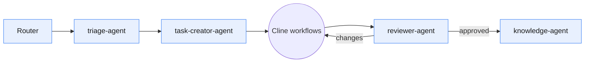

# Agents

Strix has **four Claude agents — all reasoning, no coding**. There are
deliberately **no coding agents**: execution is Cline's runtime, driven by
workflows, not agents.

## The Four Agents

### triage-agent
First responder. Runs intent + complexity detection and routes the request.
Never lets a raw request reach Cline; never sends an EPIC to execution.
Spec: [../.claude/agents/triage-agent.md](../.claude/agents/triage-agent.md).

### task-creator-agent
Authors well-formed tasks; decomposes EPICs into STANDARD tasks with
dependencies and scope estimates. Fills every required task field.
Spec: [../.claude/agents/task-creator-agent.md](../.claude/agents/task-creator-agent.md).

### reviewer-agent
Gate between Review and Done. Verifies Acceptance Criteria, conventions, risk,
and over-engineering; approves or returns a precise checklist. Reads source,
never edits it. Spec: [../.claude/agents/reviewer-agent.md](../.claude/agents/reviewer-agent.md).

### knowledge-agent
Keeper of the knowledge layer. After approval, applies governance: updates
`knowledge/*` and authors ADRs only when a trigger fires.
Spec: [../.claude/agents/knowledge-agent.md](../.claude/agents/knowledge-agent.md).

## Why No Coding Agents

Coding is execution. Execution belongs to Cline, structured by the five
[Cline workflows](../.clinerules/workflows/), not by Claude agents. Keeping agents
reasoning-only preserves the runtime boundary and prevents responsibility
overlap.

## Selection

Agents are chosen by the Router (see [router.md](./router.md)); they never
self-select their skills, context, or successor.
