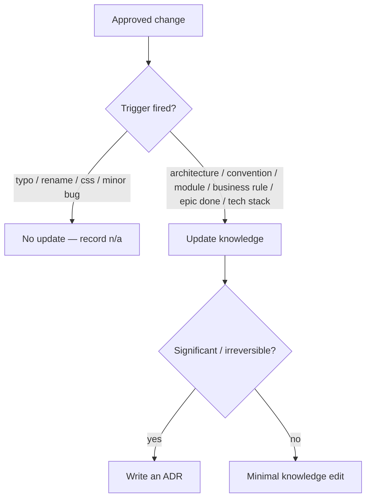

# Governance

Governance keeps the knowledge base coherent and the runtimes honest. It answers
one question precisely: **when does Claude update knowledge, and when must it
not?**

## Knowledge Update Policy

### Must Update
- **Architecture** — structure changed.
- **Convention** — a rule in `coding-conventions.md` changed.
- **Module** — added, removed, or renamed.
- **Business rule** — domain behaviour changed.
- **EPIC completion** — refresh context/progress/architecture.
- **Tech stack** — a technology was added/removed/upgraded.

### Never Update
- **Typo** · **Rename** · **CSS fixes** · **Minor bug**.

For "never" cases, record `n/a` in the task's Definition of Done so the decision
is explicit and auditable.

## Who May Do What

Derived from the [capability matrix](../workflow/capability-matrix.md):

- **Claude** owns all reasoning + all knowledge writes.
- **Cline** owns all execution + knowledge reads only.
- No responsibility is shared except *reading* knowledge.

## Enforcement

- `reviewer-agent` blocks tasks that over-reach scope or leave a triggered
  knowledge update undone.
- `knowledge-agent` is the only writer of `knowledge/*` and ADRs.
- The `Status` field and task directory must agree; mismatch is a defect.

## ADR Discipline

Significant or hard-to-reverse decisions get an ADR (one per file, sequential,
immutable — supersede, never rewrite). Template + rules:
[../knowledge/decisions/README.md](../knowledge/decisions/README.md).

## Anti-Over-Engineering

Every task carries **Out of Scope** and **Estimated Files**. Anything beyond
them is over-engineering and fails review. This is governance at the execution
edge, mirroring knowledge governance at the reasoning edge.
