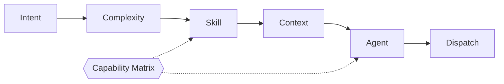

# Router

The Router is the single decision-maker (Layer 2), running on Claude. **The
Router always decides; agents never self-select.**

## Five Functions



1. **Intent Detection** — feature | fix | refactor | question | arch | knowledge | review.
2. **Complexity Detection** — TRIVIAL | SIMPLE | STANDARD | EPIC.
3. **Skill Selection** — minimal skills → task `Suggested Skills`.
4. **Context Selection** — minimal `knowledge/*` + task fields to load.
5. **Agent Selection** — the Claude agent or Cline workflow to run.

## Capability-Driven Dispatch

The Router resolves *what capability is needed* and looks up its owner in the
[capability matrix](../workflow/capability-matrix.md) — it never names an engine
in a rule. This is what lets Strix add future engines without changing Router
logic.


## Decision Record

Per request the Router emits an auditable object:

```yaml
intent: feature
complexity: STANDARD
skills: [architecture, task-breakdown]
context: [project-context.md, coding-conventions.md]
agent: task-creator-agent
capability: task_breakdown
```

## Routing Table (summary)

| Intent | Complexity | Agent / Workflow |
|--------|-----------|------------------|
| question | any | triage-agent |
| feature | SIMPLE/STANDARD | task-creator-agent → implement |
| feature | EPIC | task-creator-agent → decompose |
| fix | any | task-creator-agent → fix |
| refactor | STANDARD | task-creator-agent → refactor |
| arch | STANDARD/EPIC | task-creator-agent + ADR |
| review | any | reviewer-agent |
| knowledge | any | knowledge-agent |

Full rules: [../.claude/rules/routing.md](../.claude/rules/routing.md) ·
[../workflow/router.md](../workflow/router.md).

## Invariants

- Router runs before any agent/workflow.
- Agents receive skills + context; they don't choose them.
- EPIC never dispatches to execution.
- Every dispatch resolves through the capability matrix.
