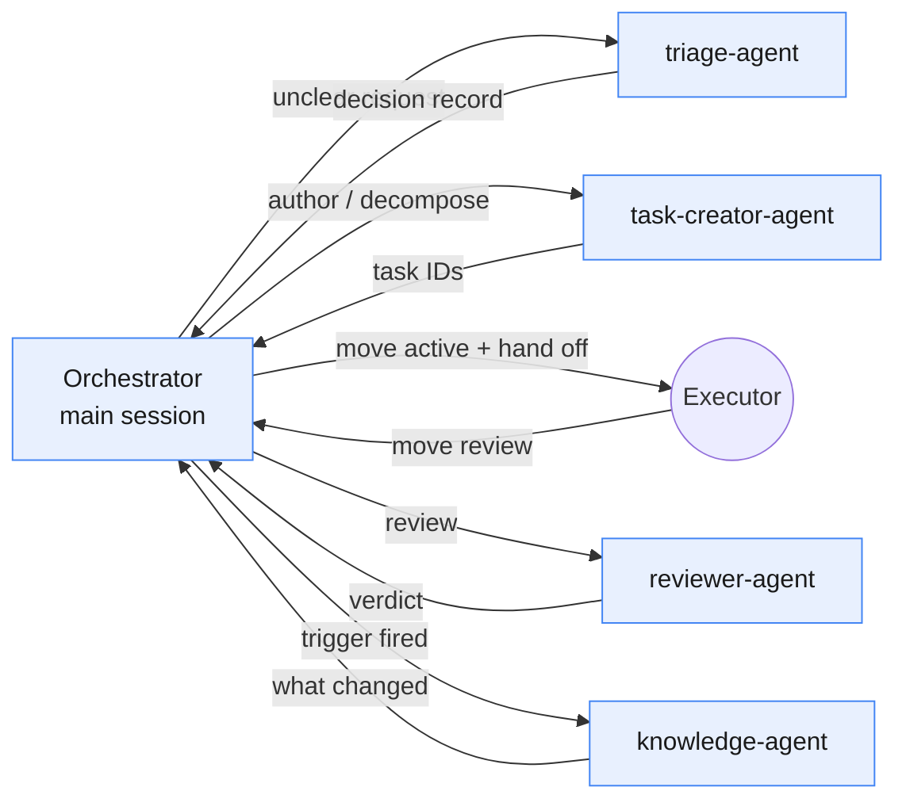

# Agents

Strix has **four Claude agents — all reasoning, no coding**. There are
deliberately **no coding agents**: execution is the executor's runtime, driven by
workflows, not agents.

The **main Claude session is the orchestrator**. It runs the Router, owns every
decision about what happens next, and calls an agent only for a bounded job. An
agent returns its result to the orchestrator; it never hands work to another
agent, and none of them has the `Agent` tool.

## The Four Agents

| Agent | Tools | Model | Writes |
|-------|-------|-------|--------|
| `triage-agent` | Read, Grep, Glob, Bash | sonnet | nothing |
| `task-creator-agent` | Read, Grep, Glob, Bash, Edit, Write | inherit | task files in `queue/` |
| `reviewer-agent` | Read, Grep, Glob, Bash | inherit | only through `strix-task note` and `move` |
| `knowledge-agent` | Read, Grep, Glob, Bash, Edit, Write | inherit | `.strix/knowledge/**` |

`npm run validate` enforces the `tools:` lists: every agent declares one, none
includes `Agent`, and the two read-only agents have no write tool.

### triage-agent
Optional classifier. The orchestrator triages simple requests inline and calls
this agent only when intent or size needs a wide read of the codebase. Returns a
decision record; never sends an EPIC to execution.
Spec: `agents/triage-agent.md`.

### task-creator-agent
Authors well-formed tasks with `strix-task new` and fills every field, so each
passes `strix-task check`. Decomposes EPICs into STANDARD tasks with
dependencies and scope estimates. Returns the IDs it created.
Spec: `agents/task-creator-agent.md`.

### reviewer-agent
Gate between Review and Done. Reads `strix-task diff <ID>`, re-runs the checks
the Execution Report lists, and verifies Acceptance Criteria, conventions, risk,
and over-engineering. Approves with `move <ID> done`, or records a Review
Checklist with `strix-task note` and moves the task back to active. Never edits
source. Spec: `agents/reviewer-agent.md`.

### knowledge-agent
Keeper of the knowledge layer. Runs the one-time adoption scan, and after
approval applies governance: updates `knowledge/*` and authors ADRs only when a
trigger fires. Reports what changed, or `n/a`.
Spec: `agents/knowledge-agent.md`.

## Why No Coding Agents

Coding is execution. Execution belongs to the executor, structured by the five
executor workflows (for Cline, `templates/executors/cline/.clinerules/workflows/`),
not by Claude agents. Keeping agents reasoning-only preserves the runtime
boundary and prevents responsibility overlap.

## Selection

The orchestrator chooses agents through the Router (see [router.md](./router.md));
agents never self-select their skills, context, or successor.
