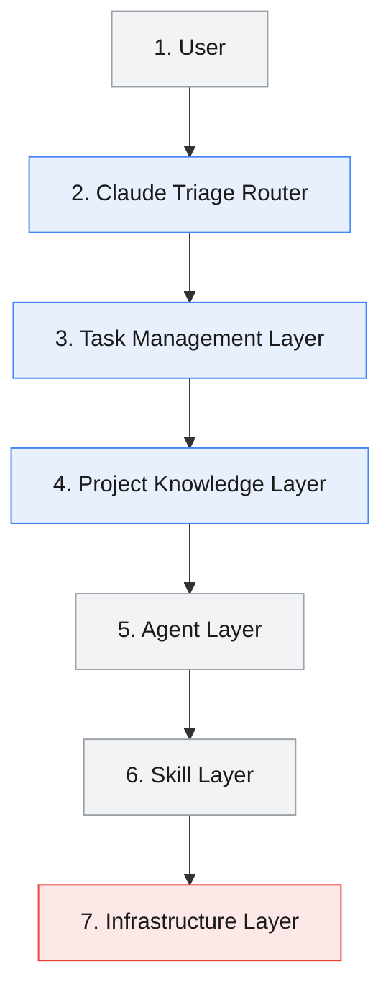
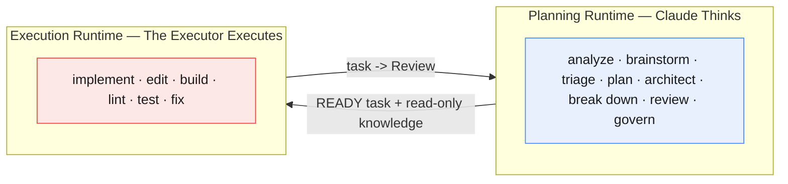

# Architecture

Strix is a **hybrid, task-driven, layered** AI coding workflow. It separates
reasoning (Claude) from execution (the executor) and routes everything through a single
decision-maker. This document is the map; each section links to the canonical
spec.

## The Seven Layers

| Layer | What it is | Canonical spec |
|-------|-----------|----------------|
| User | Human requests | — |
| Claude Triage Router | Classifies + routes | [router.md](./router.md) |
| Task Management | The task board + lifecycle | [../../templates/strix/tasks/README.md](../../templates/strix/tasks/README.md) |
| Project Knowledge | Source of truth | [knowledge.md](./knowledge.md) |
| Agent Layer | 4 Claude agents | [agents.md](./agents.md) |
| Skill Layer | 20 reusable skills | [skills.md](./skills.md) |
| Infrastructure | Files, terminal, build, test | Executor runtime |

## Two Runtimes

Canonical: [../workflow/runtime-separation.md](../workflow/runtime-separation.md).

## Design Principles

Task-Driven · Hybrid · Layered · Router-Based · Skill-First · Knowledge-Driven ·
Claude Thinks · The Executor Executes · Minimize context · Prevent over-engineering ·
Long-term maintainability. Full list:
[../workflow/README.md](../workflow/README.md).

## Engine-Agnostic Core

Components never hard-code engine names; they resolve capabilities through the
[capability matrix](../workflow/capability-matrix.md). Adding an engine is a data
edit — see [Quality Requirements](#quality-requirements).

## Quality Requirements

Modular · easy to extend · no duplicated responsibilities · reasoning separated
from execution · small prompts · reusable context · optimized tokens · supports
future engines. Each is realized by a specific mechanism documented in
[governance.md](./governance.md) and the capability matrix.
