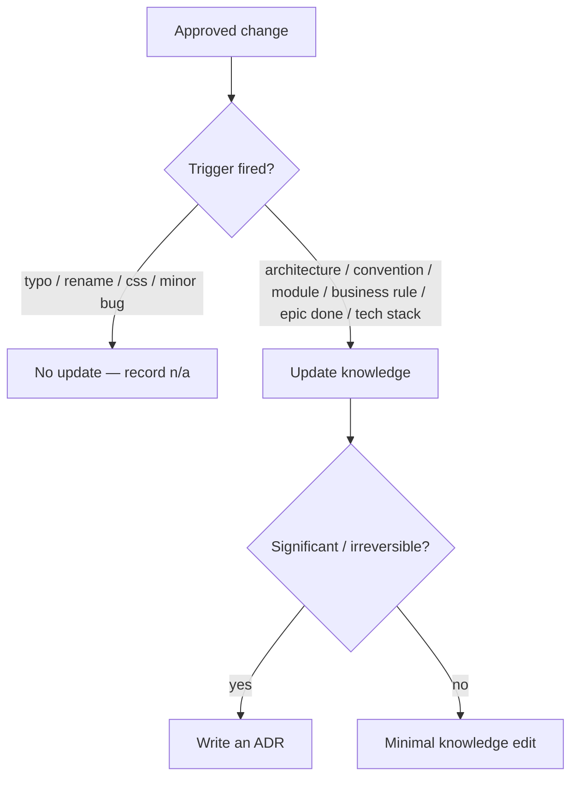

# Governance

Governance keeps the knowledge base coherent and the runtimes honest. It answers
one question precisely: **when does Claude update knowledge, and when must it
not?**

## Knowledge Update Policy

### Must Update
- **Architecture** — structure changed.
- **Convention** — a rule in `coding-conventions.md` changed.
- **Module** — added, removed, or renamed.
- **Business rule** — domain behaviour changed.
- **EPIC completion** — refresh context/progress/architecture.
- **Tech stack** — a technology was added/removed/upgraded.

### Never Update
- **Typo** · **Rename** · **CSS fixes** · **Minor bug**.

For "never" cases, record `n/a` in the task's Definition of Done so the decision
is explicit and auditable.

## Initial Adoption Scan (One-Time Exception)

The policy above governs updates *after an approved task*. Adopting Strix into an
existing codebase is the one case where a full `knowledge/*` population happens
**without a prior task or trigger** — because there is no task yet to gate
against. The `knowledge-agent`, via the [`project-scan`](../../skills/project-scan/SKILL.md)
skill, reads the real project and fills all four knowledge files at once.

This exception is bounded:

- **Evidence-only.** Every populated fact must trace to something in the scanned
  repo — manifests, configs, code, or docs. Anything not evidenced stays a
  placeholder or is marked `n/a`; the scan never fabricates a stack, module, or
  convention.
- **One-time.** It runs once per adoption. Once `knowledge/*` is populated, all
  further changes go back through the trigger-gated policy above.
- **Auditable.** The scan concludes with an adoption ADR (per
  [`decisions/README.md`](../../templates/strix/knowledge/decisions/README.md)) recording what was
  scanned, the confidence per file, and what was left `n/a`.

## Who May Do What

Generated from [`config/capabilities.yaml`](../../config/capabilities.yaml), the
source of the [capability matrix](../workflow/capability-matrix.md).

<!-- strix:gen start id=capability-ownership-summary -->
- **Claude** owns 15 of 21 capabilities — every capability in Router / Planning, Planning, Router, Task Management, Knowledge, Shared.
- **Executor** owns 7 of 21 capabilities — every capability in Infrastructure, Shared. Read-only on Knowledge read.
- Shared by more than one engine: **Knowledge read** (Executor read-only), **Run terminal** (Claude on demand confirm).
<!-- strix:gen end id=capability-ownership-summary -->

## Enforcement

- `reviewer-agent` blocks tasks that over-reach scope or leave a triggered
  knowledge update undone.
- `knowledge-agent` is the only writer of `knowledge/*` and ADRs.
- The `Status` field and task directory must agree; mismatch is a defect.

## ADR Discipline

Significant or hard-to-reverse decisions get an ADR (one per file, sequential,
immutable — supersede, never rewrite). Template + rules:
[../../templates/strix/knowledge/decisions/README.md](../../templates/strix/knowledge/decisions/README.md).

## Anti-Over-Engineering

Every task carries **Out of Scope** and **Estimated Files**. Anything beyond
them is over-engineering and fails review. This is governance at the execution
edge, mirroring knowledge governance at the reasoning edge.
