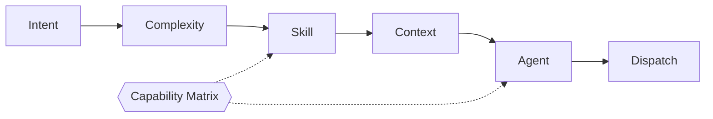
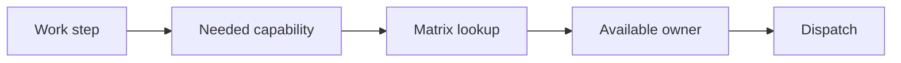

# Router

The Router is the single decision-maker (Layer 2), running on Claude. **The
Router always decides; agents never self-select.**

## Five Functions



1. **Intent Detection** — exactly one intent (below).
2. **Complexity Detection** — exactly one level (below).
3. **Skill Selection** — minimal skills → task `Suggested Skills`.
4. **Context Selection** — minimal `knowledge/*` + task fields to load.
5. **Agent Selection** — the Claude agent or executor workflow to run.

**Intents:**

<!-- strix:gen start id=intents-inline -->
`feature` · `fix` · `refactor` · `question` · `arch` · `knowledge` · `review` · `skill-install` · `onboarding`
<!-- strix:gen end id=intents-inline -->

**Complexity:**

<!-- strix:gen start id=complexity-inline -->
`TRIVIAL` · `SIMPLE` · `STANDARD` · `EPIC`
<!-- strix:gen end id=complexity-inline -->

## Capability-Driven Dispatch

The Router resolves *what capability is needed* and looks up its owner in the
[capability matrix](../workflow/capability-matrix.md) — it never names an engine
in a rule. This is what lets Strix add future engines without changing Router
logic.



## Decision Record

Per request the Router emits an auditable object:

<!-- strix:gen start id=decision-record -->
```yaml
intent: feature
complexity: STANDARD
skills: [planning, architecture]
context: [project-context.md, coding-conventions.md]
agent: task-creator-agent
capability: task_breakdown
```
<!-- strix:gen end id=decision-record -->

## Routing Table (summary)

Generated from [`config/routing.yaml`](../../config/routing.yaml) — edit there,
then run `npm run gen`.

<!-- strix:gen start id=routing-table-summary -->
| Intent | Complexity | Agent / Workflow |
| -------- | ----------- | ------------------ |
| question | any | orchestrator (answer, or route as another intent) |
| feature | TRIVIAL | orchestrator · lite task, no reviewer → `implement` |
| feature | SIMPLE | `task-creator-agent` → `implement` |
| feature | STANDARD | `task-creator-agent` (+ADR if structural) → `implement` |
| feature | EPIC | `task-creator-agent` → `decompose` |
| fix | TRIVIAL | orchestrator · lite task, no reviewer → `fix` |
| fix | SIMPLE | `task-creator-agent` → `fix` |
| fix | STANDARD | `task-creator-agent` → `fix` |
| fix | EPIC | `task-creator-agent` → `decompose` |
| refactor | TRIVIAL | orchestrator · lite task, no reviewer → `refactor` |
| refactor | SIMPLE | `task-creator-agent` → `refactor` |
| refactor | STANDARD | `task-creator-agent` (+ADR if structural) → `refactor` |
| refactor | EPIC | `task-creator-agent` → `decompose` |
| arch | TRIVIAL/SIMPLE | reclassify as STANDARD (an architecture decision is never trivial) |
| arch | STANDARD | `task-creator-agent` (+ADR) |
| arch | EPIC | `task-creator-agent` (+ADR) → `decompose` |
| review | any | `reviewer-agent` |
| onboarding | any | `knowledge-agent` → `project-scan` |
| knowledge | any | `knowledge-agent` |
| skill-install | any | orchestrator → `skill-manager` |
<!-- strix:gen end id=routing-table-summary -->

Full rules: [../rules/routing.md](../rules/routing.md) ·
[../workflow/router.md](../workflow/router.md).

## Invariants

- Router runs before any agent/workflow.
- Agents receive skills + context; they don't choose them.
- EPIC never dispatches to execution.
- Every dispatch resolves through the capability matrix.
