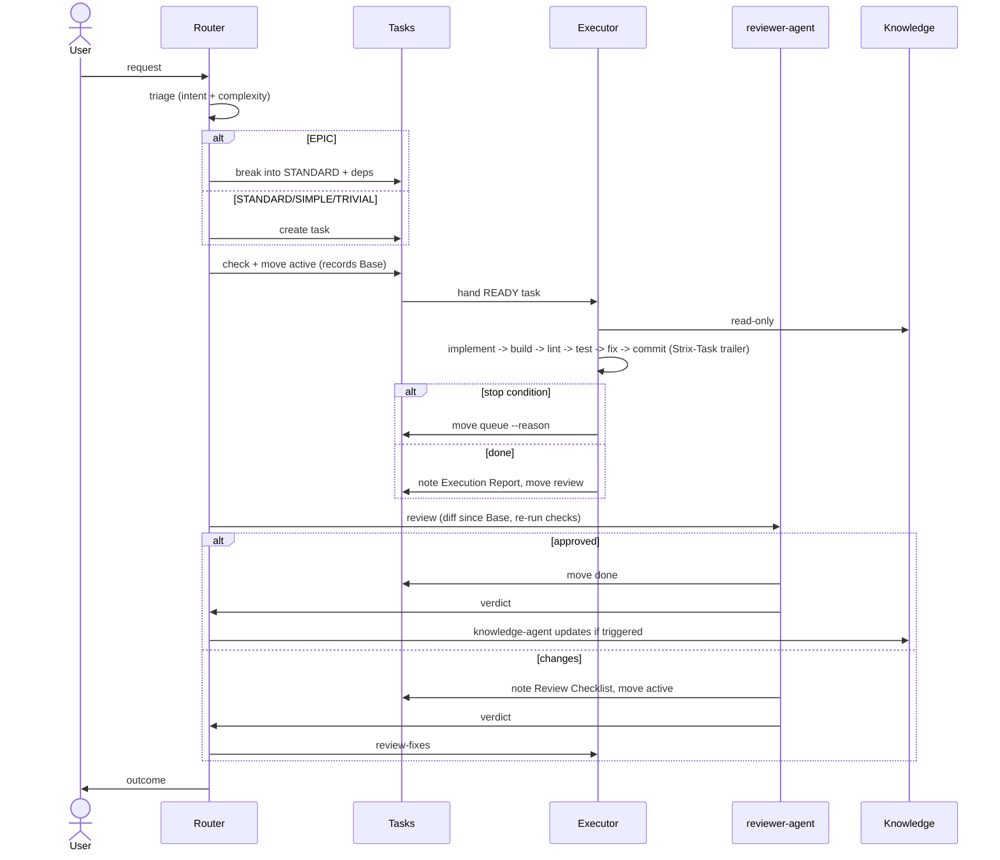

# Workflow

How a request becomes shipped, reviewed, knowledge-governed code.

## Task-Driven, Always

Nothing runs without a task. Every request is triaged by Claude, classified, and
turned into one or more tasks before the executor touches anything. Canonical:
[../workflow/task-driven-workflow.md](../workflow/task-driven-workflow.md).

## Complexity Levels

| Level | Meaning | Path |
|-------|---------|------|
| TRIVIAL | One obvious edit | Straight to a one-line task |
| SIMPLE | One change, one skill | Single task |
| STANDARD | One feature, multi-file | Full task (the atomic unit) |
| EPIC | Multi-feature | **Break into STANDARD tasks first** |

Canonical: [../workflow/complexity-levels.md](../workflow/complexity-levels.md).
**Never send an EPIC directly to the executor.**

## End-to-End

## Task Lifecycle

Queue → Active → Review → Done → Archive. Each stage is a directory under
`tasks/`, with tasks grouped by workstream inside it, and `strix-task` owns every
move, enforcing its gate and recording it in the task's History. Canonical: [../workflow/task-lifecycle.md](../workflow/task-lifecycle.md).

## Runtime Boundaries

- **Claude** never writes code, commits, or runs build/lint/tests to produce a
  change (it may inspect state and re-run a task's reported checks).
- **The executor** never redesigns, changes conventions/knowledge/ADRs, or expands
  scope.

Canonical: [../workflow/runtime-separation.md](../workflow/runtime-separation.md).

## Executor Workflows

`implement` · `fix` · `refactor` · `testing` · `review-fixes` — see the Cline
profile (one example executor):
[../../templates/executors/cline/.clinerules/workflows/](../../templates/executors/cline/.clinerules/workflows/).
