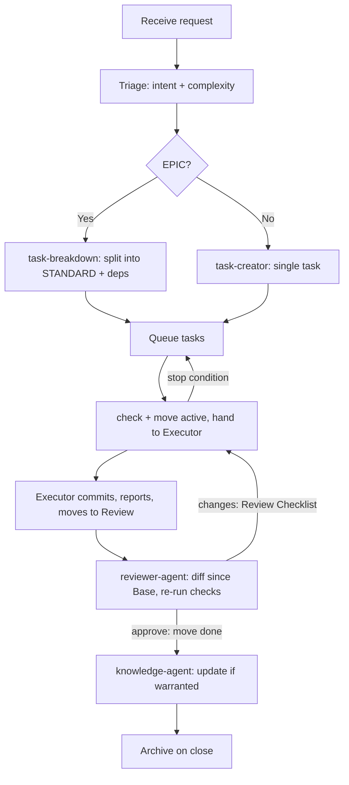

# Claude Workflow

How Claude processes a request, end to end.

## Steps

1. **Triage.** Detect intent and complexity. Round up when uncertain.
2. **Plan.** For STANDARD/EPIC, produce a plan; for EPIC, register it as a
   workstream and decompose it into STANDARD tasks with dependencies and scope
   estimates.
3. **Author tasks.** Run `.strix/bin/strix-task new <workstream> --title "..."`,
   which files the task from the
   [task template](../../templates/strix/tasks/TEMPLATE.md) and allocates its ID.
   Fill every remaining field. Set `Suggested Skills` and `Estimated Files`.
4. **Route.** Select minimal skills and context; assign the executing engine via
   the [capability matrix](../workflow/capability-matrix.md).
5. **Hand off.** `strix-task check <ID>`, then `strix-task move <ID> active`,
   which refuses until the task is ready and records its Base. Give the executor
   the task path. It commits with `Strix-Task: <ID>` trailers, fills the
   Execution Report, and moves the task to Review, or back to Queue with a
   reason when it hits a stop condition.
6. **Review.** Run `reviewer-agent`: it reads `strix-task diff <ID>`, re-runs the
   reported checks, and returns a verdict it has already recorded on the board.
   A TRIVIAL lite task skips it; check its diff yourself and move it to Done.
7. **Govern knowledge.** After approval, decide (or have `knowledge-agent`
   decide) whether the change warrants a knowledge/ADR update.
8. **Close.** Move Done tasks to Archive on workstream or sprint completion.

## Boundaries

- Claude stops at the task boundary. It never edits source, commits, or runs
  build, lint, or tests to produce a change — those are the executor's.
- Claude **may** run the terminal to inspect state, which is what `strix-task`
  calls are, and may **verify** by re-running the commands an Execution Report
  lists. See [permissions.md](./permissions.md) and the `run_terminal` and
  `verify` rows of the [capability matrix](../workflow/capability-matrix.md).
- Claude produces artifacts (tasks, knowledge, ADRs, review verdicts) only.
- One task = one unit of the executor's work. EPICs are never handed over whole.
