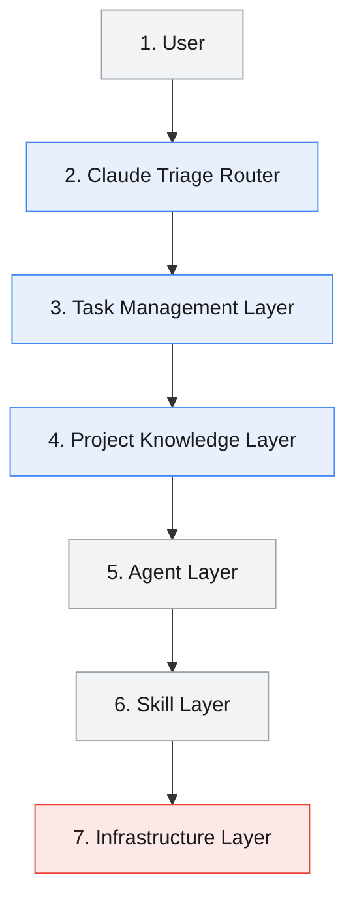
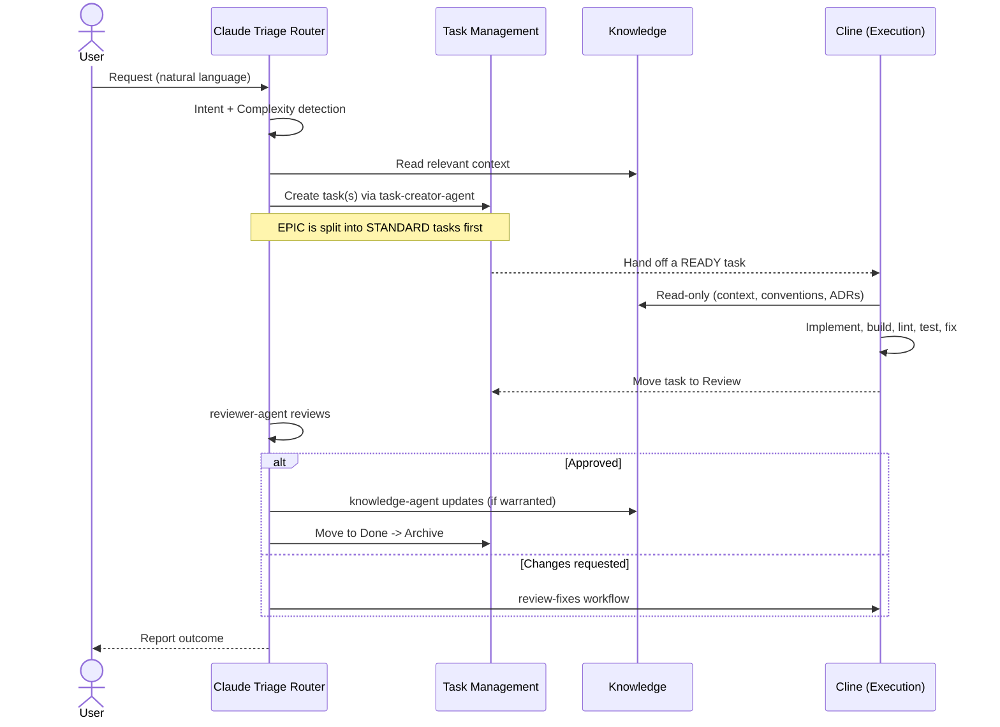

# Strix Workflow Core

The `workflow/` directory is the **engine-agnostic core** of Strix. It defines
*how* work moves through the system without hard-coding *which* engine performs
it. Engines (Claude, Cline, and any future engine) are described declaratively
in the [Capability Matrix](./capability-matrix.md); every other component reads
that matrix instead of naming an engine directly.

## Design Principles

Strix is built on eleven principles. Every file in this repository must be
traceable back to one of them.

1. **Task-Driven Architecture** — nothing is implemented that is not first a task.
2. **Hybrid Workflow** — reasoning and execution are two distinct runtimes.
3. **Layered Architecture** — seven layers, each with one responsibility.
4. **Router-Based Decision Making** — a single Router decides; agents never self-select.
5. **Skill-First Design** — reusable skills carry the how-to; prompts stay small.
6. **Knowledge-Driven Development** — the knowledge layer is the source of truth.
7. **Claude Thinks.** — Claude owns reasoning.
8. **Cline Executes.** — Cline owns execution.
9. **Minimize context.** — load only the knowledge and skills a task needs.
10. **Prevent over-engineering.** — implement only what the task defines.
11. **Long-term maintainability.** — modular, extensible, no duplicated responsibility.

## The Seven Layers

| # | Layer | Responsibility | Owner |
|---|-------|----------------|-------|
| 1 | User | Submits requests in natural language | Human |
| 2 | Claude Triage Router | Classifies, routes, selects skills/context/agents | Claude |
| 3 | Task Management Layer | Holds tasks and moves them through the lifecycle | Claude writes, Cline reads |
| 4 | Project Knowledge Layer | Source of truth for context, conventions, architecture, ADRs | Claude writes, Cline reads |
| 5 | Agent Layer | Specialised Claude reasoning agents | Claude |
| 6 | Skill Layer | Reusable reasoning + implementation skills | Both (by kind) |
| 7 | Infrastructure Layer | Files, terminal, build, lint, test, VCS | Cline |

## End-to-End Flow

## Where To Look Next

- Runtime boundaries → [runtime-separation.md](./runtime-separation.md)
- How requests are sized → [complexity-levels.md](./complexity-levels.md)
- How work is structured → [task-driven-workflow.md](./task-driven-workflow.md)
- How a task travels → [task-lifecycle.md](./task-lifecycle.md)
- Who can do what → [capability-matrix.md](./capability-matrix.md)
- How routing decides → [router.md](./router.md)
