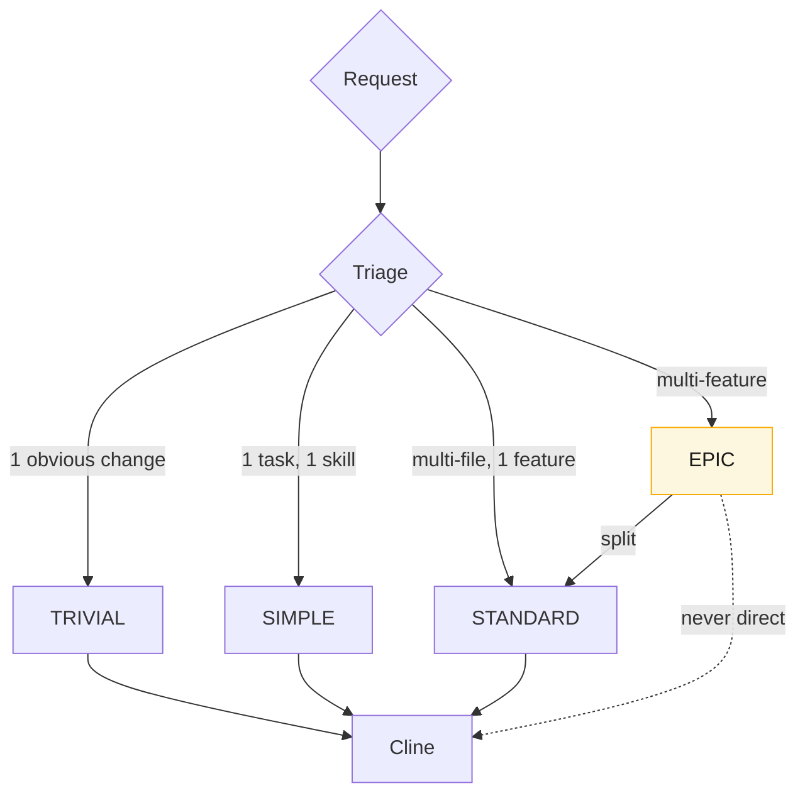

# Complexity Levels

Every request is classified by the **Claude Triage Router** into exactly one of
four levels. The level decides how much planning ceremony a request gets and
whether it may go straight to Cline.

## Criteria

Generated from [`config/routing.yaml`](../../config/routing.yaml) — edit there,
then run `npm run gen`.

<!-- strix:gen start id=complexity-criteria -->
### TRIVIAL

- **What:** A single, obvious edit with no design content.
- **Examples:** fix a typo, rename a variable, tweak a CSS value, update a copy string.
- **Files:** usually 1.
- **Planning:** none. Router may hand a one-line task straight to the execution engine.
- **Knowledge:** never updated.

### SIMPLE

- **What:** One well-understood change requiring one skill and no new decisions.
- **Examples:** add a field to an existing form, add one endpoint mirroring an existing one, add a unit test.
- **Files:** 1–3.
- **Planning:** a single task with Acceptance Criteria. No architecture step.
- **Knowledge:** rarely updated (only if a convention is touched).

### STANDARD

- **What:** One coherent feature or fix spanning multiple files, possibly multiple skills, with a bounded design surface.
- **Examples:** add authentication to a route group, introduce a caching layer for one module, migrate one table.
- **Files:** 3–15.
- **Planning:** full task with Requirements, Out of Scope, Dependencies, Acceptance Criteria, DoR/DoD. May need an ADR.
- **Knowledge:** updated when it introduces/changes a module, convention, or business rule.

> **This is the atomic unit the execution engine runs. Everything larger is decomposed to STANDARD.**

### EPIC

- **What:** A goal that spans multiple features, modules, or subsystems.
- **Examples:** build the billing system, migrate the app to Next.js, add multi-tenancy.
- **Files:** many, across modules.
- **Planning:** MUST be broken into STANDARD tasks with explicit dependencies and scope estimates before any execution.
- **Knowledge:** updated on completion (architecture, modules, and usually one or more ADRs).
<!-- strix:gen end id=complexity-criteria -->

> **Never send an EPIC directly to Cline.** An EPIC that reaches execution
> un-decomposed is a routing error.

## Decision Heuristics

<!-- strix:gen start id=complexity-heuristics -->
| Signal | Likely level |
| -------- | -------------- |
| No decision to make, one edit | TRIVIAL |
| One skill, no new pattern | SIMPLE |
| New pattern but one feature | STANDARD |
| Multiple features / "and then" chains | EPIC |
| Touches architecture or a new module | STANDARD (with ADR) or EPIC |
| Requires sequencing / dependencies | EPIC |
<!-- strix:gen end id=complexity-heuristics -->

When in doubt, round **up** one level; over-planning a SIMPLE task is cheaper
than under-planning a STANDARD one.
