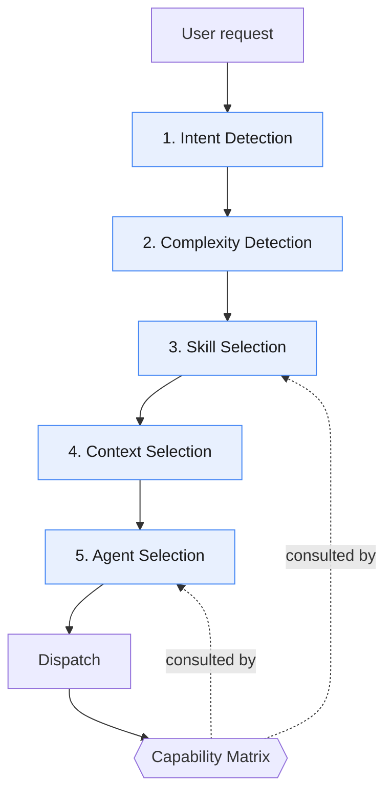
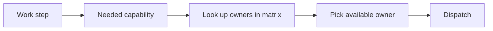

# Router

The Router is the single decision-maker in Strix. It sits at Layer 2 (Claude
Triage Router) and runs on Claude. **The Router always decides. Agents never
self-select.** No agent picks its own skills, context, or successor — it
receives them from the Router.



## The Five Router Functions

### 1. Intent Detection
Classify what the user actually wants: *new feature*, *bug fix*, *refactor*,
*question*, *architecture change*, *knowledge request*, *review*, or *onboarding*
(a first-time scan of an existing codebase to populate the knowledge layer).
Intent drives which agent and which Cline workflow will ultimately run.

### 2. Complexity Detection
Classify the request as **TRIVIAL / SIMPLE / STANDARD / EPIC**
(see [complexity-levels.md](./complexity-levels.md)). An EPIC is decomposed
before anything else proceeds.

### 3. Skill Selection
Choose the minimal set of skills the work needs — reasoning skills for Claude,
implementation skills for Cline — and record them in the task's
`Suggested Skills`. Selection is driven by intent + complexity, validated
against the [capability matrix](./capability-matrix.md). Skill-First Design:
the skill carries the how-to so the prompt stays small.

### 4. Context Selection
Choose the **minimal knowledge** to load: only the `knowledge/*` files and task
fields relevant to this request. Minimising context is a first-class goal —
never load the whole knowledge base "just in case".

### 5. Agent Selection
Pick the Claude agent (`triage-agent`, `task-creator-agent`, `reviewer-agent`,
`knowledge-agent`) or the Cline workflow (`implement`, `fix`, `refactor`,
`testing`, `review-fixes`) that will run — chosen via the capability matrix, not
hard-coded engine names.

## Capability-Driven Dispatch

The Router never says "send to Cline". It says "this step needs the `implement`
capability → the matrix says `cline` owns it → dispatch there." This indirection
is what lets Strix add future engines without touching Router logic.



## Router Decision Record (per request)

The Router emits a small, explicit decision object so routing is auditable:

```yaml
intent: feature            # feature | fix | refactor | question | arch | knowledge | review | onboarding
complexity: STANDARD       # TRIVIAL | SIMPLE | STANDARD | EPIC
skills: [architecture, task-breakdown]
context: [project-context.md, coding-conventions.md]
agent: task-creator-agent
capability: task_breakdown
```

## Invariants

- The Router runs **before** any agent or workflow.
- Agents receive skills + context; they do **not** choose them.
- EPIC never dispatches to execution.
- Every dispatch resolves through the capability matrix.

Full narrative documentation lives in [../docs/router.md](../docs/router.md).
