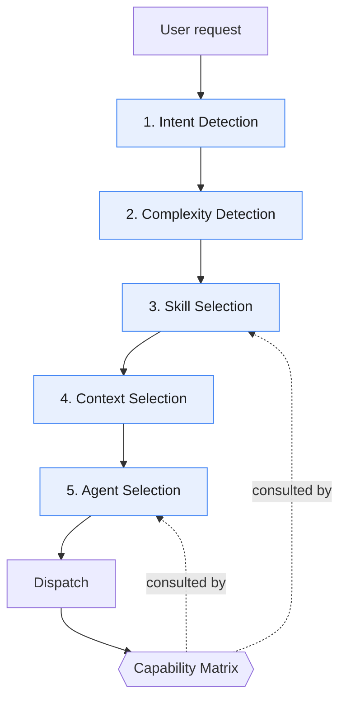
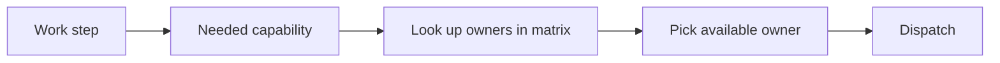

# Router

The Router is the single decision-maker in Strix (Layer 2). The Claude
orchestrator — the main Claude session in a Strix project — runs it on every
request. **The Router always decides. Agents never self-select.** No agent picks
its own skills, context, or successor — it receives them from the orchestrator
and returns its result there.

This is the one router document; `reference/docs/router.md` and
`reference/rules/routing.md` point here.



## The Five Router Functions

### 1. Intent Detection
Classify what the user actually wants. Intent drives which agent and which executor
workflow will ultimately run. Intents and complexity levels are generated from
[`config/routing.yaml`](../../config/routing.yaml).

<!-- strix:gen start id=intents-table -->
| Intent | Means |
| -------- | ------- |
| `feature` | new behaviour |
| `fix` | bug fix |
| `refactor` | restructure without behaviour change |
| `question` | needs an answer, may need no task |
| `arch` | architecture or structural decision |
| `knowledge` | knowledge layer or documentation work |
| `review` | verify completed work against criteria |
| `skill-install` | add, update, or remove a skill |
| `onboarding` | first-time scan of an existing codebase to populate the knowledge layer |
<!-- strix:gen end id=intents-table -->

### 2. Complexity Detection
Classify the request into exactly one level (see
[complexity-levels.md](./complexity-levels.md)). An EPIC is decomposed before
anything else proceeds.

<!-- strix:gen start id=complexity-inline -->
`TRIVIAL` · `SIMPLE` · `STANDARD` · `EPIC`
<!-- strix:gen end id=complexity-inline -->

### 3. Skill Selection
Choose the minimal set of skills the work needs — reasoning skills for Claude,
implementation skills for the executor — and record them in the task's
`Suggested Skills`. Selection is driven by intent + complexity, validated
against the [capability matrix](./capability-matrix.md). Skill-First Design:
the skill carries the how-to so the prompt stays small.

### 4. Context Selection
Choose the **minimal knowledge** to load: only the `knowledge/*` files and task
fields relevant to this request. Minimising context is a first-class goal —
never load the whole knowledge base "just in case".

### 5. Agent Selection
Pick who runs the step: the orchestrator itself (`orchestrator` in the routing
table), a Claude agent, or the executor workflow (`implement`, `fix`, `refactor`,
`testing`, `review-fixes`) — chosen via the capability matrix, not hard-coded
engine names. A Claude agent returns its result to the orchestrator; it never
picks its own successor. The Claude agents:

<!-- strix:gen start id=agents-inline -->
`triage-agent` (optional classifier, returns a decision) · `task-creator-agent` (author tasks, decompose EPICs) · `reviewer-agent` (gate Review → Done) · `knowledge-agent` (govern the knowledge layer)
<!-- strix:gen end id=agents-inline -->

## Routing Table

Every intent × complexity cell has exactly one route (`npm run validate` checks
the grid). Generated from [`config/routing.yaml`](../../config/routing.yaml) —
edit there, then run `npm run gen`.

<!-- strix:gen start id=routing-table -->
| Intent | Complexity | Agent / Workflow | Typical skills |
| -------- | ----------- | ------------------ | ---------------- |
| question | any | orchestrator (answer, or route as another intent) | — |
| feature | TRIVIAL | orchestrator · lite task, no reviewer → `implement` | — |
| feature | SIMPLE | `task-creator-agent` → `implement` | planning |
| feature | STANDARD | `task-creator-agent` (+ADR if structural) → `implement` | planning, architecture; if unclear first: brainstorming |
| feature | EPIC | `task-creator-agent` → `decompose` | planning, task-breakdown, architecture; if unclear first: brainstorming |
| fix | TRIVIAL | orchestrator · lite task, no reviewer → `fix` | — |
| fix | SIMPLE | `task-creator-agent` → `fix` | — |
| fix | STANDARD | `task-creator-agent` → `fix` | risk-analysis |
| fix | EPIC | `task-creator-agent` → `decompose` | task-breakdown, risk-analysis |
| refactor | TRIVIAL | orchestrator · lite task, no reviewer → `refactor` | — |
| refactor | SIMPLE | `task-creator-agent` → `refactor` | risk-analysis |
| refactor | STANDARD | `task-creator-agent` (+ADR if structural) → `refactor` | architecture, risk-analysis |
| refactor | EPIC | `task-creator-agent` → `decompose` | task-breakdown, architecture, risk-analysis |
| arch | TRIVIAL/SIMPLE | reclassify as STANDARD (an architecture decision is never trivial) | — |
| arch | STANDARD | `task-creator-agent` (+ADR) | architecture, risk-analysis, adr; if unclear first: brainstorming |
| arch | EPIC | `task-creator-agent` (+ADR) → `decompose` | architecture, task-breakdown, risk-analysis, adr; if unclear first: brainstorming |
| review | any | `reviewer-agent` | review, risk-analysis |
| onboarding | any | `knowledge-agent` → `project-scan` | project-scan, architecture, adr |
| knowledge | any | `knowledge-agent` | knowledge-update, documentation |
| skill-install | any | orchestrator → `skill-manager` | skill-manager, risk-analysis |
<!-- strix:gen end id=routing-table -->

How to read a row:

- **orchestrator** — the main session handles it, with no helper agent.
- **→ `workflow`** — the executor workflow (or `decompose`, or a skill) that follows.
- **(+ADR)** — the route always records an ADR; **(+ADR if structural)** only
  when the change is structural.
- **lite task, no reviewer** — the TRIVIAL fast path: `strix-task new --lite`,
  and the orchestrator checks the diff itself.
- **if unclear first** — skills to run before planning when the request is
  ambiguous.
- **reclassify** — the cell is not a real size for that intent; route it as the
  named level.

## Capability-Driven Dispatch

The Router never says "send to the executor". It says "this step needs the `implement`
capability → the matrix says `executor` owns it → dispatch there." This indirection
is what lets Strix add future engines without touching Router logic.



## Router Decision Record (per request)

The Router emits a small, explicit decision object so routing is auditable:

<!-- strix:gen start id=decision-record -->
```yaml
intent: feature
complexity: STANDARD
skills: [planning, architecture]
context: [project-context.md, coding-conventions.md]
agent: task-creator-agent
capability: task_breakdown
```
<!-- strix:gen end id=decision-record -->

`intent`, `complexity`, `skills`, and `capability` are drawn from the enumerations
above and from [capability-matrix.md](./capability-matrix.md).

## Minimise Context

- Load a `knowledge/*` file only if the decision depends on it.
- Pass a task, not a transcript, to execution.
- Prefer a `Suggested Skill` reference over inlining how-to into the prompt.

## Invariants

- The Router runs **before** any agent or workflow.
- Agents receive skills + context; they do **not** choose them.
- EPIC never dispatches to execution.
- Every dispatch resolves through the capability matrix.
