# Runtime Separation

Strix runs on **two runtimes that never blur**. The separation is the backbone
of the hybrid workflow: reasoning is expensive to get right and cheap to redo;
execution is mechanical and must be reproducible. Keeping them apart keeps each
prompt small and each responsibility single.

```mermaid
flowchart LR
    subgraph Planning["Planning Runtime — Claude Thinks"]
        direction TB
        P1[Requirement analysis]
        P2[Brainstorming]
        P3[Triage]
        P4[Planning]
        P5[Architecture]
        P6[Task breakdown]
        P7[Review]
        P8[Knowledge + ADR updates]
    end

    subgraph Execution["Execution Runtime — Cline Executes"]
        direction TB
        E1[Implement tasks]
        E2[Edit / refactor files]
        E3[Run terminal]
        E4[Build]
        E5[Lint]
        E6[Test]
        E7[Fix failures]
    end

    Planning -- "READY task + knowledge (read-only)" --> Execution
    Execution -- "task -> Review" --> Planning

    classDef think fill:#e8f0fe,stroke:#4285f4,color:#1a1a1a;
    classDef exec fill:#fde8e8,stroke:#ea4335,color:#1a1a1a;
    class P1,P2,P3,P4,P5,P6,P7,P8 think;
    class E1,E2,E3,E4,E5,E6,E7 exec;
```

## Planning Runtime

**Engine:** Claude — see [runtimes/planning-runtime.md](./runtimes/planning-runtime.md).

**Responsibilities:** requirement analysis, brainstorming, triage, planning,
architecture, task breakdown, review, knowledge updates, ADR management.

**Claude MUST NOT:** write production code, modify source files directly,
execute build, execute lint, execute tests. Claude **MAY** run the terminal on
demand (inspect state, verify) — this capability is shared with Cline.

## Execution Runtime

**Engine:** Cline — see [runtimes/execution-runtime.md](./runtimes/execution-runtime.md).

**Responsibilities:** implement tasks, read task definitions, read project
knowledge, edit files, refactor, run terminal, build, lint, test, fix failures.

**Cline MUST NOT:** redesign architecture, modify coding conventions, modify
project knowledge, modify ADRs, expand task scope, over-engineer.

> Cline always implements **only what is inside the task**.

## The Handoff Contract

The two runtimes communicate exclusively through **two immutable artifacts**:

1. **The Task** (Task Management Layer) — the sole unit of work Cline accepts.
2. **The Knowledge** (Project Knowledge Layer) — read-only for Cline.

Claude never reaches into the infrastructure; Cline never reaches into the
reasoning. This one-way street is what makes the framework auditable: every
change Cline makes maps to a task Claude authored, and every architectural
decision maps to an ADR Claude wrote.
