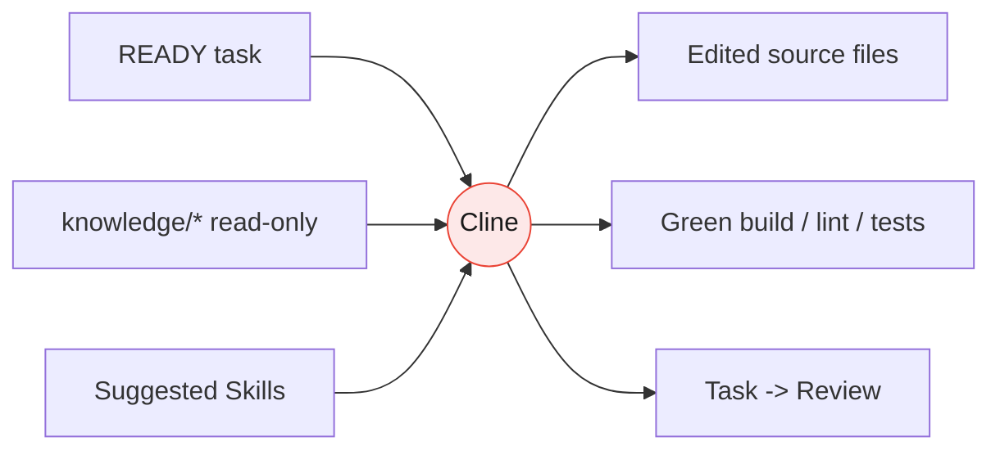

# Execution Runtime

> **Engine:** Cline &nbsp;|&nbsp; **Motto:** *Cline Executes.*

The Execution Runtime is the doing half of Strix. It consumes a single READY
task plus read-only knowledge and turns them into working, tested code. It
produces **side effects inside a bounded scope**, never new design.

## Responsibilities

| Responsibility | Detail |
|----------------|--------|
| Implement tasks | Build exactly what the task Requirements define |
| Read task definitions | The task is the only source of scope |
| Read project knowledge | Conventions, context, architecture, ADRs (read-only) |
| Edit files | Create/modify source within Estimated Files |
| Refactor | Only when the task calls for it |
| Run terminal | Package managers, generators, scripts |
| Build | Compile / bundle |
| Lint | Enforce conventions mechanically |
| Test | Run and extend the test suite |
| Fix failures | Iterate until build + lint + tests are green |

## Hard Prohibitions

Cline in the Execution Runtime **MUST NOT**:

- Redesign architecture
- Modify coding conventions
- Modify project knowledge
- Modify ADRs
- Expand task scope
- Over-engineer

> **Always implement only what is inside the task.** If the task is wrong,
> incomplete, or requires a design decision, Cline **stops and returns the task
> to Review** with a note — it does not improvise.

## Inputs and Outputs

## The Stop Conditions

Cline halts and escalates to the Planning Runtime when it hits any of:

1. The task requires a decision not covered by knowledge or the task itself.
2. Satisfying Acceptance Criteria would require changing an ADR or convention.
3. The scope would grow beyond the Estimated Files / Out of Scope boundaries.
4. Build, lint, or tests reveal a design flaw rather than an implementation bug.

Escalation is a feature, not a failure: it keeps reasoning in the runtime that
owns it.
