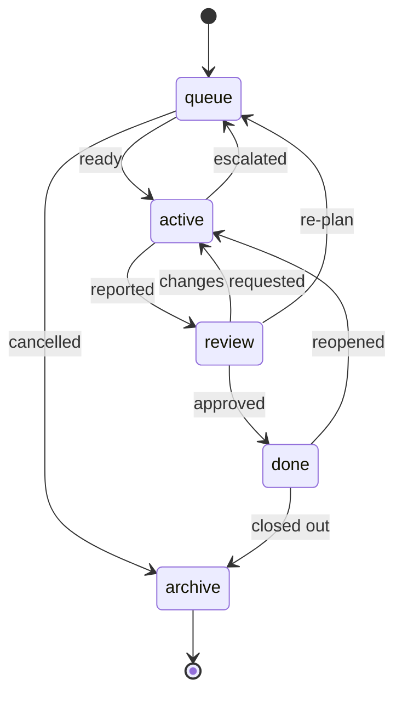

# Task Lifecycle

A task travels through five stages. Each stage is a directory under `tasks/`,
and within a stage tasks are grouped by **workstream** — one named line of work,
normally one EPIC. The filesystem itself is the board:

<!-- strix:gen start id=board-path -->
`.strix/tasks/{stage}/{workstream}/{id}-{slug}.md`
<!-- strix:gen end id=board-path -->

Grouping by workstream is what lets two people run unrelated efforts on one board
without reading past each other's tasks. `.strix/bin/strix-task` performs every
move below; nothing should construct one of these paths by hand.

<!-- strix:gen start id=transition-diagram -->

<!-- strix:gen end id=transition-diagram -->

`strix-task move` allows only these moves, each behind its gate, and appends every
move to the task's `## History` with the time, the actor, and the reason. Any other
move needs `--override "<reason>"`, which is recorded the same way.

<!-- strix:gen start id=transition-table -->
| Move | Owner | Gate | Meaning |
| ------ | ------- | ------ | --------- |
| `queue` → `active` | orchestrator | no placeholders, Definition of Ready ticked, dependencies Done | Definition of Ready met and every dependency Done |
| `queue` → `archive` | orchestrator | `--reason` required | cancelled before work started |
| `active` → `review` | executor | Execution Report filled | Definition of Done met and the Execution Report filled |
| `active` → `queue` | executor | `--reason` required | escalated — a stop condition needs re-planning |
| `review` → `active` | reviewer | Review Checklist filled | changes requested in the Review Checklist |
| `review` → `queue` | reviewer | `--reason` required | the task itself is wrong and needs re-planning |
| `review` → `done` | reviewer | — | approved |
| `done` → `active` | orchestrator | `--reason` required | reopened |
| `done` → `archive` | orchestrator | — | workstream or sprint closed |
<!-- strix:gen end id=transition-table -->

| Stage | Directory | Meaning |
|-------|-----------|---------|
| Queue | `tasks/queue/<ws>/` | Created, waiting; may still be blocked by deps |
| Active | `tasks/active/<ws>/` | Pulled for execution; the executor is working it |
| Review | `tasks/review/<ws>/` | Implementation committed and reported, awaiting reviewer-agent |
| Done | `tasks/done/<ws>/` | Approved; knowledge updated if warranted |
| Archive | `tasks/archive/<ws>/` | Closed out or cancelled; kept for history |

A task keeps its workstream for life; only its stage changes. A workstream
directory is created when its first task arrives and removed when its last one
leaves, so empty ones never accumulate.

## Stage Detail

### 1. Queue
- **Created by:** the orchestrator or `task-creator-agent`, via
  `strix-task new <workstream> --title "..."`, which allocates the next ID within
  that workstream. A TRIVIAL change can use `--lite`, which keeps only Goal,
  Estimated Files, Acceptance Criteria, Execution Report, and History.
- **Status field:** `Queued`.
- **Exit gate (`ready`):** every template placeholder replaced, every Definition
  of Ready box ticked (lite tasks have none), and every task in `Dependencies`
  in Done or Archive. `strix-task check <ID>` runs this gate on its own, and
  `strix-task next` lists which queued tasks pass it.
- **On the move:** `strix-task move <ID> active` records **Base**, the commit the
  work starts from (`git rev-parse HEAD`, or `none (...)` outside a repository).
- A task can sit in Queue indefinitely while blocked. A task that will never be
  done is cancelled with `move <ID> archive --reason "..."`.

### 2. Active
- **Owner:** the executor (Execution Runtime).
- **Status field:** `In Progress`.
- **Work:** implement, build, lint, test, fix — strictly within scope. Every
  commit carries a `Strix-Task: <ID>` trailer so the reviewer can find it.
- **Exit gate (`reported`):** the Definition of Done holds and the Execution
  Report is filled with
  `strix-task note <ID> --section "Execution Report" --text "..."`: the commands
  run, their exit codes, the tail of their output, and the commit SHAs. Then the
  executor runs `strix-task move <ID> review`.
- **Escalation:** on a stop condition the executor runs
  `strix-task move <ID> queue --reason "..."`; it never redesigns.

### 3. Review
- **Owner:** `reviewer-agent` (Claude).
- **Status field:** `In Review`.
- **Work:** `strix-task diff <ID>` shows the task's commits since Base. The
  reviewer checks Acceptance Criteria, conventions, risk, and over-engineering,
  and may re-run the Execution Report's commands to verify them.
- **Three outcomes:**
  - **Changes requested** → `strix-task note <ID> --section "Review Checklist"`,
    then `move <ID> active` (the `checklist` gate needs that note). The executor
    applies it with its `review-fixes` workflow.
  - **Approved** → `move <ID> done`.
  - **The task itself is wrong** → `move <ID> queue --reason "..."` for
    re-planning.

### 4. Done
- **Owner:** the orchestrator.
- **Status field:** `Done`.
- **Work:** decide whether knowledge/ADRs need updating (see
  [../docs/governance.md](../docs/governance.md)). A regression reopens the task
  with `move <ID> active --reason "..."`.

### 5. Archive
- **Owner:** the orchestrator.
- **Status field:** `Archived`.
- **Work:** on workstream or sprint close, Done tasks are moved to Archive for an
  auditable trail. Nothing is deleted.

## History

Every move appends one line to the task's `## History`:

```
- 2026-09-17T16:00:00Z · queue → active · quan · —
- 2026-09-17T17:20:00Z · active → queue · executor · needs an ADR first
```

An `--override` move is a waiver, not a defect: `strix-task doctor` stops
checking the gate that move bypassed — the `ready` gate when the activation was
overridden, the `reported` gate when the move into the task's current stage was
— and the reason stays in History. An ordinary move that crosses a gate again
restores it.

The actor is `--by`, else `STRIX_ACTOR`, else the OS user. Executors pass
`--by executor` and the reviewer `--by reviewer-agent`. An `--override` move
records `override: <reason>`.

Strix never commits `.strix/`. Moves, notes, and History are committed by the
user with the project's normal workflow; `strix-task diff` ignores them.

## Board Invariants

`strix-task doctor` checks the whole board and fails on any of these:

1. The `Status` field matches the stage directory.
2. The `Workstream` field matches the parent directory.
3. The task ID carries that workstream's registered prefix.
4. The workstream is listed in `workstreams.yaml` with status `active` or
   `closed`, and is still `active` unless the task has reached Done or Archive.
5. Every ID names exactly one task, and the header `ID` matches the filename.
6. No EPIC sits on the board.
7. Every dependency names a task on the board, and no dependencies form a cycle.
8. Past the queue (active, review, done): no template placeholders are left and
   a Base is recorded.
9. In review and done: the Execution Report is filled.

The directories are the fast visual board; the in-file fields are the record that
survives copy/paste and diffs. `reviewer-agent` treats any failure as a defect.

Using `strix-task` for every move is what keeps these aligned without anyone
having to remember them.
