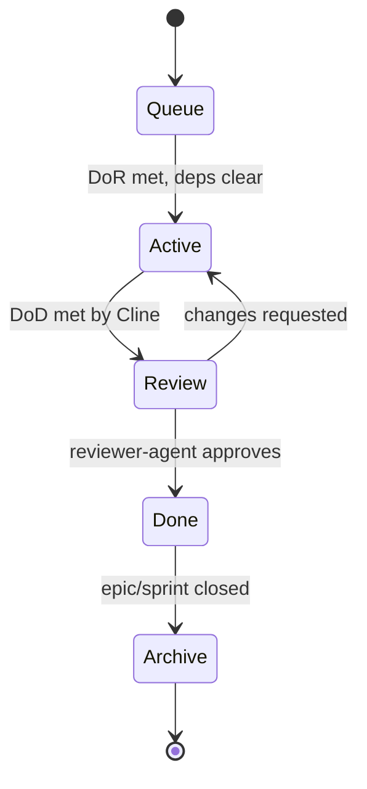

# Task Lifecycle

A task travels through five stages. Each stage is a directory under `tasks/`,
so the filesystem itself is the board.

| Stage | Directory | Owner of the move | Meaning |
|-------|-----------|-------------------|---------|
| Queue | `tasks/queue/` | Claude | Created, waiting; may still be blocked by deps |
| Active | `tasks/active/` | Claude → Cline | Pulled for execution; Cline is working it |
| Review | `tasks/review/` | Cline → Claude | Implementation done, awaiting reviewer-agent |
| Done | `tasks/done/` | Claude | Approved and merged; knowledge updated if warranted |
| Archive | `tasks/archive/` | Claude | Closed out; kept for history |

## Stage Detail

### 1. Queue
- **Created by:** `task-creator-agent` (Claude).
- **Status field:** `Queued`.
- **Entry gate:** the task exists and is well-formed.
- **Exit gate:** **Definition of Ready** is satisfied *and* all `Dependencies`
  are `Done`. Only then may it become Active.
- A task can sit in Queue indefinitely while blocked.

### 2. Active
- **Owner:** Cline (Execution Runtime).
- **Status field:** `In Progress`.
- **Entry gate:** DoR met; Router assigned it; deps clear.
- **Work:** implement, build, lint, test, fix — strictly within scope.
- **Exit gate:** **Definition of Done** is satisfied (build/lint/tests green,
  Acceptance Criteria met). Cline moves the task to Review.
- **Escalation:** if Cline hits a stop condition, it returns the task to Queue
  (or flags Review) with a note; it never redesigns.

### 3. Review
- **Owner:** `reviewer-agent` (Claude).
- **Status field:** `In Review`.
- **Work:** verify Acceptance Criteria, conventions, risk, over-engineering.
- **Two outcomes:**
  - **Changes requested** → back to Active via the `review-fixes` workflow.
  - **Approved** → to Done.

### 4. Done
- **Owner:** Claude.
- **Status field:** `Done`.
- **Work:** `knowledge-agent` decides whether knowledge/ADRs need updating
  (see [../docs/governance.md](../docs/governance.md)). Merge is confirmed.

### 5. Archive
- **Owner:** Claude.
- **Status field:** `Archived`.
- **Work:** on epic or sprint close, Done tasks are moved to Archive for an
  auditable trail. Nothing is deleted.

## Status Field vs Directory

The task's `Status` field and its directory must always agree. The directory is
the fast visual board; the `Status` field is the in-file record that survives
copy/paste and diffs. `reviewer-agent` treats a mismatch as a defect.
