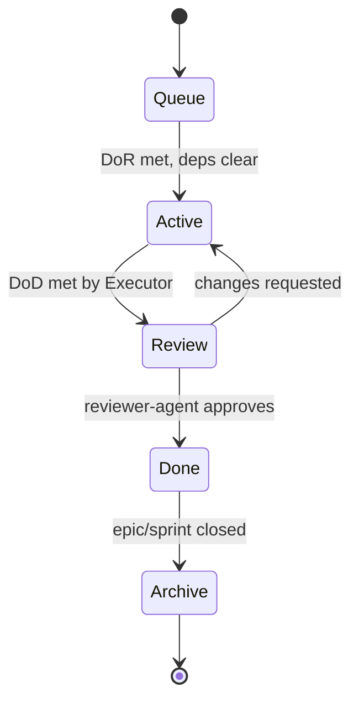

# Task Lifecycle

A task travels through five stages. Each stage is a directory under `tasks/`,
and within a stage tasks are grouped by **workstream** — one named line of work,
normally one EPIC. The filesystem itself is the board:

<!-- strix:gen start id=board-path -->
`.strix/tasks/{stage}/{workstream}/{id}-{slug}.md`
<!-- strix:gen end id=board-path -->

Grouping by workstream is what lets two people run unrelated efforts on one board
without reading past each other's tasks. `.strix/bin/strix-task` performs every
move below; nothing should construct one of these paths by hand.

| Stage | Directory | Owner of the move | Meaning |
|-------|-----------|-------------------|---------|
| Queue | `tasks/queue/<ws>/` | Claude | Created, waiting; may still be blocked by deps |
| Active | `tasks/active/<ws>/` | Claude → the executor | Pulled for execution; the executor is working it |
| Review | `tasks/review/<ws>/` | the executor → Claude | Implementation done, awaiting reviewer-agent |
| Done | `tasks/done/<ws>/` | Claude | Approved and merged; knowledge updated if warranted |
| Archive | `tasks/archive/<ws>/` | Claude | Closed out; kept for history |

A task keeps its workstream for life; only its stage changes. A workstream
directory is created when its first task arrives and removed when its last one
leaves, so empty ones never accumulate.

## Stage Detail

### 1. Queue
- **Created by:** `task-creator-agent` (Claude), via
  `strix-task new <workstream> --title "..."`, which allocates the next ID within
  that workstream.
- **Status field:** `Queued`.
- **Entry gate:** the task exists and is well-formed.
- **Exit gate:** **Definition of Ready** is satisfied *and* all `Dependencies`
  are `Done`. Only then may it become Active.
- A task can sit in Queue indefinitely while blocked.

### 2. Active
- **Owner:** the executor (Execution Runtime).
- **Status field:** `In Progress`.
- **Entry gate:** DoR met; Router assigned it; deps clear.
- **Work:** implement, build, lint, test, fix — strictly within scope.
- **Exit gate:** **Definition of Done** is satisfied (build/lint/tests green,
  Acceptance Criteria met). The executor moves the task to Review.
- **Escalation:** if the executor hits a stop condition, it returns the task to Queue
  (or flags Review) with a note; it never redesigns.
- **Moves:** `strix-task move <ID> review` — it relocates the file inside the
  task's own workstream and rewrites `Status` in one step.

### 3. Review
- **Owner:** `reviewer-agent` (Claude).
- **Status field:** `In Review`.
- **Work:** verify Acceptance Criteria, conventions, risk, over-engineering.
- **Two outcomes:**
  - **Changes requested** → back to Active via the `review-fixes` workflow.
  - **Approved** → to Done.

### 4. Done
- **Owner:** Claude.
- **Status field:** `Done`.
- **Work:** `knowledge-agent` decides whether knowledge/ADRs need updating
  (see [../docs/governance.md](../docs/governance.md)). Merge is confirmed.

### 5. Archive
- **Owner:** Claude.
- **Status field:** `Archived`.
- **Work:** on epic or sprint close, Done tasks are moved to Archive for an
  auditable trail. Nothing is deleted.

## Board Invariants

Four things must agree, and `strix-task doctor` checks all four:

1. The `Status` field matches the stage directory.
2. The `Workstream` field matches the parent directory.
3. The task ID carries that workstream's registered prefix.
4. The workstream is listed in `workstreams.yaml`, and is still `active` unless
   the task has reached Done or Archive.

The directories are the fast visual board; the in-file fields are the record that
survives copy/paste and diffs. `reviewer-agent` treats any mismatch as a defect.

Using `strix-task` for every move is what keeps these aligned without anyone
having to remember them.
