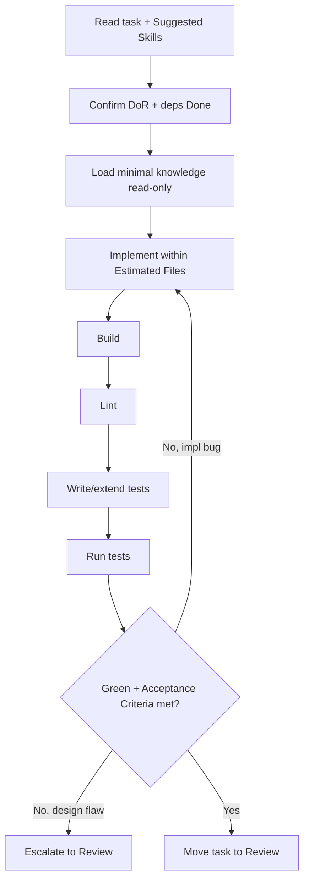

# Workflow: implement

Build a new feature or capability defined by a STANDARD (or SIMPLE) task.

## When The Router Selects It

Intent = `feature` and the task creates new behaviour.

## Execution Flow

## Steps

1. **Read** the task; load `Suggested Skills` (e.g. `react`, `node`,
   `typescript`) and only the knowledge it references.
2. **Verify DoR** and that dependencies are Done. If not, return to Queue.
3. **Implement** the Requirements within `Estimated Files`. No extra scope.
4. **Build** and resolve compile errors.
5. **Lint** and fix style to match `coding-conventions.md`.
6. **Test**: add/extend tests to cover the Acceptance Criteria; run the suite.
7. **Check** every Acceptance Criterion. Iterate on implementation bugs.
8. **Complete**: on green + criteria met + Definition of Done satisfied, move the
   task to `.strix/tasks/review/` and set `Status: In Review`.

## Guardrails

- Out of Scope is binding. Over-engineering fails review.
- Design decisions escalate; they are never made here.
