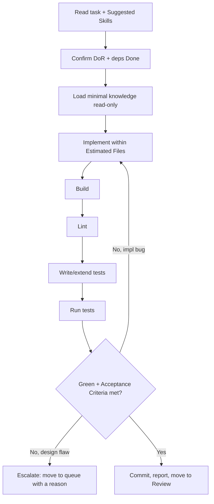

# Workflow: implement

Build a new feature or capability defined by a STANDARD (or SIMPLE) task.

## When The Router Selects It

Intent = `feature` and the task creates new behaviour.

## Execution Flow

## Steps

1. **Read** the task; load `Suggested Skills` (e.g. `react`, `node`,
   `typescript`) and only the knowledge it references.
2. **Verify DoR** and that dependencies are Done. If not, run
   `.strix/bin/strix-task move <ID> queue --reason "<what is missing>" --by executor` and stop.
3. **Implement** the Requirements within `Estimated Files`. No extra scope.
4. **Build** and resolve compile errors.
5. **Lint** and fix style to match `.strix/knowledge/coding-conventions.md`.
6. **Test**: add/extend tests to cover the Acceptance Criteria; run the suite.
7. **Check** every Acceptance Criterion. Iterate on implementation bugs.
8. **Complete**: when the Definition of Done holds:
   - commit the work; every commit message ends with the trailer line
     `Strix-Task: <ID>`;
   - record the Execution Report with
     `.strix/bin/strix-task note <ID> --section "Execution Report" --text "..." --by executor`:
     each command run, its exit code, the tail of its output, and the commit SHAs;
   - run `.strix/bin/strix-task move <ID> review --by executor`. It refuses without the report,
     and it moves the task within its workstream and sets `Status: In Review`.
{{#copilot}}
   If your current mode cannot run commands, print these exact commands and ask
   the human to run them.
{{/copilot}}

## Guardrails

- Out of Scope is binding. Over-engineering fails review.
- Design decisions escalate; they are never made here.
