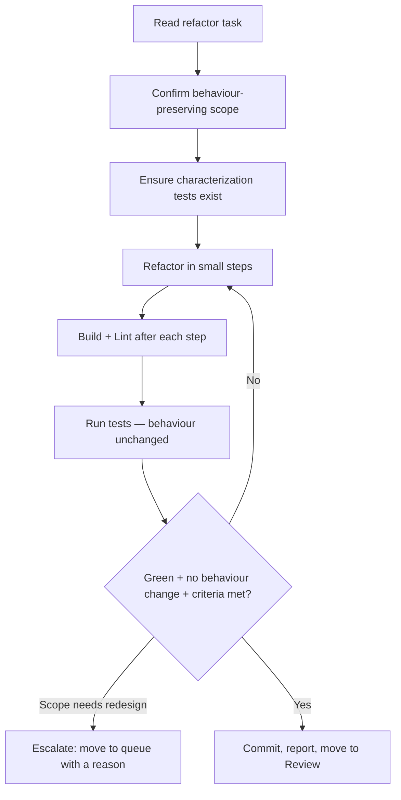

# Workflow: refactor

Improve internal structure **without changing external behaviour**, as defined
by a refactor task.

## When The Router Selects It

Intent = `refactor`. The task specifies what to restructure and the invariants
to preserve.

## Execution Flow

## Steps

1. **Read** the task; identify the target and the **invariants** that must not
   change (public APIs, outputs, side effects).
2. **Safety net**: confirm tests cover current behaviour; if gaps exist and the
   task allows, add characterization tests first (`testing` skill).
3. **Refactor in small, verified steps** (`performance`, `typescript`, or
   relevant skills). Never mix a behaviour change into a refactor.
4. **Verify after each step**: build, lint, run tests. Behaviour must stay
   identical.
5. **Escalate** if the "refactor" actually requires a design change or new ADR —
   that is a Planning-Runtime decision.
   Run `.strix/bin/strix-task move <ID> queue --reason "<what needs deciding>" --by executor` and stop.
6. **Complete**: when the Definition of Done holds:
   - commit the work; every commit message ends with the trailer line
     `Strix-Task: <ID>`;
   - record the Execution Report with
     `.strix/bin/strix-task note <ID> --section "Execution Report" --text "..." --by executor`:
     each command run, its exit code, the tail of its output, and the commit SHAs;
   - run `.strix/bin/strix-task move <ID> review --by executor`. It refuses without the report,
     and it moves the task within its workstream and sets `Status: In Review`.
{{#copilot}}
   If your current mode cannot run commands, print these exact commands and ask
   the human to run them.
{{/copilot}}

## Guardrails

- A refactor that changes behaviour is out of scope by definition.
- No new features. No convention changes.
