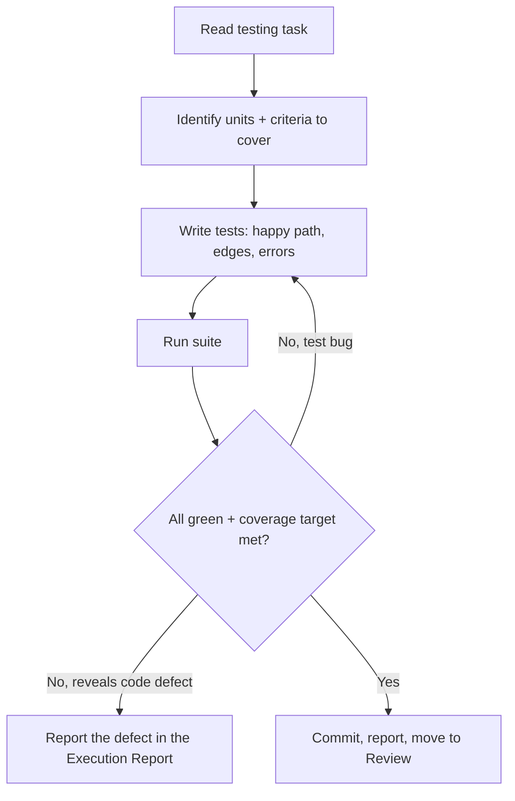

# Workflow: testing

Add or strengthen tests for existing or new code, as defined by a testing task.

## When The Router Selects It

Intent = `feature`/`fix` with a testing-focused task, or an explicit
"increase coverage / add tests" task.

## Execution Flow

## Steps

1. **Read** the task; identify the units and the Acceptance Criteria that define
   "adequately tested".
2. **Design cases** with the `testing` skill: happy path, boundaries, error
   handling, and state transitions.
3. **Write tests** following the project's test conventions
   (`.strix/knowledge/coding-conventions.md`).
4. **Run** the suite; ensure new tests pass and nothing regresses.
5. **If a test uncovers a real defect**, do not silently patch scope — record it
   in the Execution Report so the orchestrator can file a `fix` task.
6. **Complete**: when the Definition of Done holds:
   - commit the work; every commit message ends with the trailer line
     `Strix-Task: <ID>`;
   - record the Execution Report with
     `.strix/bin/strix-task note <ID> --section "Execution Report" --text "..." --by executor`:
     each command run, its exit code, the tail of its output, and the commit SHAs;
   - run `.strix/bin/strix-task move <ID> review --by executor`. It refuses without the report,
     and it moves the task within its workstream and sets `Status: In Review`.
{{#copilot}}
   If your current mode cannot run commands, print these exact commands and ask
   the human to run them.
{{/copilot}}

## Guardrails

- Tests assert real behaviour, not implementation trivia.
- Meeting a coverage number by testing nothing meaningful fails review.
