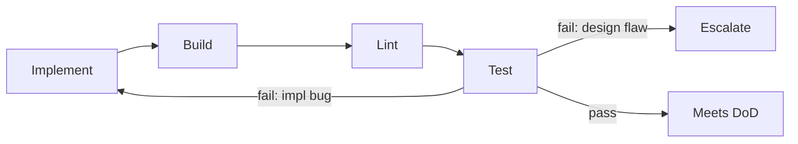

# Executor Execution Rules

The operational discipline for turning a task into green, tested code.

## The Execution Loop

## Rules

1. **Read before writing.** Load the task and its `Suggested Skills`; skim the
   `Estimated Files`. Confirm Definition of Ready.
2. **Stay in scope.** Touch only files the task implies. New files are fine if
   the task needs them; new *features* are not.
3. **Follow conventions verbatim.** `coding-conventions.md` is law. If code
   would need to break a convention, escalate — do not bend the convention.
4. **Verify continuously.** Build, lint, and test after meaningful changes, not
   only at the end.
5. **Fix implementation bugs; escalate design flaws.** If a failure reveals a
   flaw in the *task or architecture*, stop and run
   `.strix/bin/strix-task move <ID> queue --reason "<the flaw>" --by executor`.
6. **Leave the tree green.** A task reaches Review only with passing build,
   lint, and tests, every Acceptance Criterion satisfied, the work committed,
   and the Execution Report filled.

## Commits and the Execution Report

- Commit the task's work on the current branch, following the project's branch
  conventions. Every commit message ends with the trailer line
  `Strix-Task: <ID>`; `strix-task diff <ID>` shows the reviewer exactly those
  commits. Don't mix in unrelated changes, and don't leave task work uncommitted.
  Never commit `.strix/`: board changes are the user's to commit.
- Before moving to Review, record the Execution Report with
  `.strix/bin/strix-task note <ID> --section "Execution Report" --text "..." --by executor`:
  each command run, its exit code, the tail of its output, and the commit SHAs.
  The reviewer re-runs those exact commands, so list them exactly.

## Stop Conditions (escalate, don't improvise)

On any of these, run `.strix/bin/strix-task move <ID> queue --reason "..." --by executor` and stop.

- A decision is required that the task and knowledge do not cover.
- Meeting a criterion would require changing an ADR or convention.
- Scope would exceed Estimated Files / violate Out of Scope.
- A failure is a design flaw, not an implementation bug.

## Anti-Over-Engineering

- No abstractions "for the future" unless the task asks for them.
- No extra endpoints, options, or config beyond Requirements.
- No opportunistic refactors outside the task — file a follow-up task instead.
