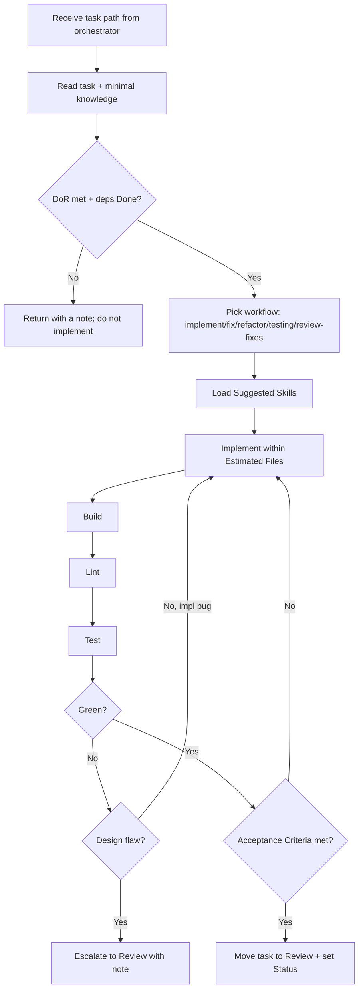

# Executor Workflow

How the executor processes the one task the orchestrator hands it, from Active to
Review. Unlike an autonomous board-puller, the `strix-executor` subagent is
**invoked with a specific READY task path** — it does not scan the queue itself.

## Steps

1. **Receive** the task path the orchestrator gives you; confirm its Definition
   of Ready is met and its dependencies are Done.
2. **Read** the task and only the knowledge/skills it lists. Minimise context.
3. **Choose the workflow**: [implement](workflows/implement.md),
   [fix](workflows/fix.md), [refactor](workflows/refactor.md),
   [testing](workflows/testing.md), or
   [review-fixes](workflows/review-fixes.md).
4. **Implement** strictly within `Estimated Files` and Requirements.
5. **Verify**: build → lint → test. Iterate on implementation bugs.
6. **Escalate** if a stop condition hits (design decision, ADR/convention
   change, scope growth, design flaw). Return the task with a note.
7. **Complete**: when Definition of Done holds, move the task file from
   `.strix/tasks/active/` to `.strix/tasks/review/`, set `Status: In Review`, and
   return a short summary to the orchestrator.

## Boundaries

- One task at a time. No cross-task scope bleed.
- No architecture, convention, knowledge, or ADR edits.
- No scope expansion — Out of Scope is binding.
- No `strix:` reasoning skills; no spawning planning agents.
