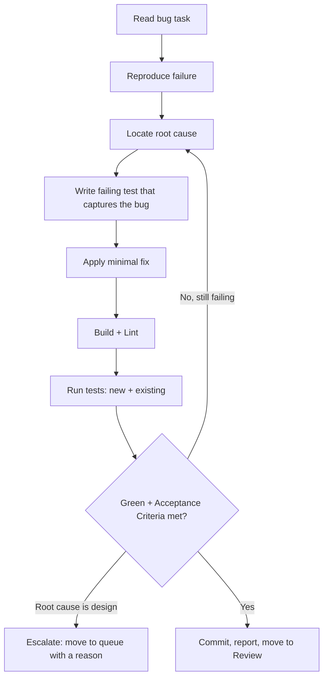

# Workflow: fix

Resolve a defect defined by a TRIVIAL, SIMPLE, or STANDARD bug task.

## When The Router Selects It

Intent = `fix`. The task describes wrong behaviour to correct.

## Execution Flow

## Steps

1. **Read** the task; note the reported symptom and Acceptance Criteria.
2. **Reproduce** the failure (test, script, or manual step per the task).
3. **Find the root cause** — fix the cause, not the symptom.
4. **Capture it**: add a failing test that would have caught the bug
   (use the `debugging` and `testing` skills).
5. **Fix minimally**: the smallest change that makes the test pass.
6. **Verify**: build, lint, and run the whole suite to check for regressions.
7. **Escalate** if the true fix requires an architecture or convention change.
   Escalate with `.strix/bin/strix-task move <ID> queue --reason "<what needs deciding>" --by executor` and stop.
8. **Complete**: when the Definition of Done holds:
   - commit the work; every commit message ends with the trailer line
     `Strix-Task: <ID>`;
   - record the Execution Report with
     `.strix/bin/strix-task note <ID> --section "Execution Report" --text "..." --by executor`:
     each command run, its exit code, the tail of its output, and the commit SHAs;
   - run `.strix/bin/strix-task move <ID> review --by executor`. It refuses without the report,
     and it moves the task within its workstream and sets `Status: In Review`.

## Guardrails

- No opportunistic refactors while fixing — file a separate task.
- The regression test is part of Definition of Done for a fix.
