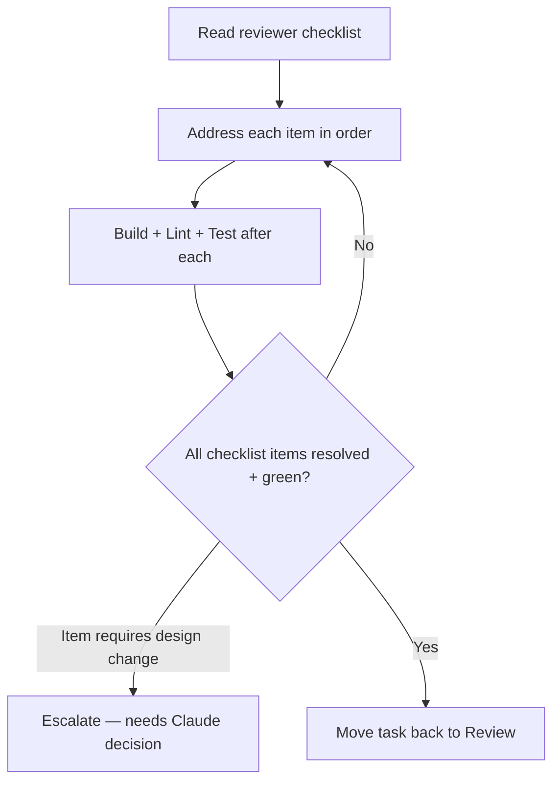

# Workflow: review-fixes

Apply the changes requested by `reviewer-agent` and return the task to Review.

## When The Router Selects It

`reviewer-agent` returned **Changes Requested** with a checklist; the task moves
Review → Active for rework.

## Execution Flow

## Steps

1. **Read** the reviewer's checklist attached to the task. Each item is a
   discrete, required change.
2. **Address each item** exactly — do not add unrequested changes while in here.
3. **Verify** after each fix: build, lint, run tests.
4. **Escalate** any checklist item that would require an architecture,
   convention, or ADR change — those are Claude decisions, not the executor's.
5. **Re-submit**: when every item is resolved and the tree is green, move the
   task back to `.strix/tasks/review/` for a second pass.

## Guardrails

- Scope is the checklist, nothing more. New scope needs a new task.
- Repeatedly bouncing on the same item signals a task/design problem — escalate
  rather than guess.
