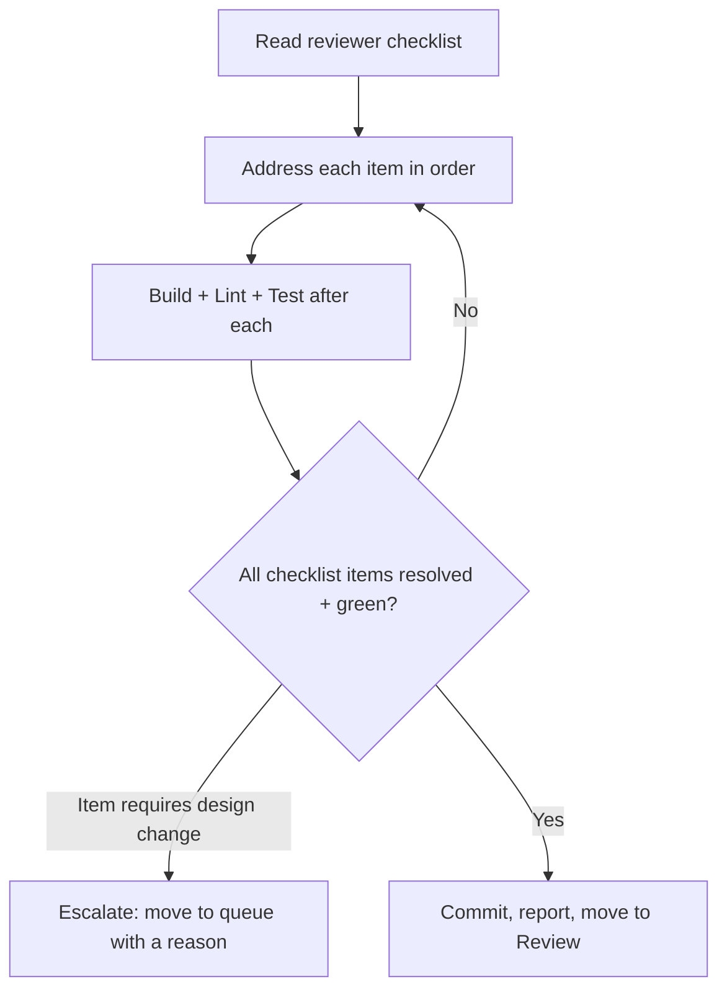

# Workflow: review-fixes

Apply the changes requested by `reviewer-agent` and return the task to Review.

## When The Router Selects It

`reviewer-agent` returned **Changes Requested** with a checklist; the task moves
Review → Active for rework.

## Execution Flow

## Steps

1. **Read** the `## Review Checklist` section of the task. Act on the **newest**
   entry (earlier rounds are history). Each item is a discrete, required change.
2. **Address each item** exactly — do not add unrequested changes while in here.
3. **Verify** after each fix: build, lint, run tests.
4. **Escalate** any checklist item that would require an architecture,
   convention, or ADR change — those are Claude decisions, not the executor's.
   Run `.strix/bin/strix-task move <ID> queue --reason "<what needs deciding>" --by executor` and stop.
5. **Complete**: when the Definition of Done holds:
   - commit the work; every commit message ends with the trailer line
     `Strix-Task: <ID>`;
   - record a **new** Execution Report entry for this round with
     `.strix/bin/strix-task note <ID> --section "Execution Report" --text "..." --by executor`:
     each command run, its exit code, the tail of its output, and the commit SHAs;
   - run `.strix/bin/strix-task move <ID> review --by executor`. It refuses without the report,
     and it moves the task within its workstream and sets `Status: In Review`.

## Guardrails

- Scope is the checklist, nothing more. New scope needs a new task.
- Repeatedly bouncing on the same item signals a task/design problem — escalate
  rather than guess.
