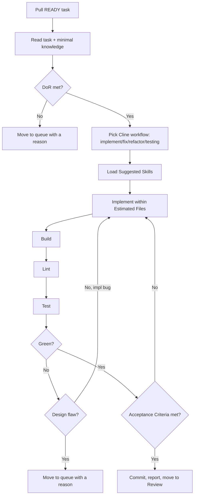

# Cline Workflow

How Cline processes one task from Active to Review.

## Steps

1. **Pull** a task the orchestrator moved to `active/`
   (`.strix/bin/strix-task ls --stage active`); `strix-task move` already checked
   its Definition of Ready and dependencies.
2. **Read** the task and only the knowledge/skills it lists. Minimise context.
3. **Choose the workflow**: [implement](workflows/implement.md),
   [fix](workflows/fix.md), [refactor](workflows/refactor.md),
   [testing](workflows/testing.md), or
   [review-fixes](workflows/review-fixes.md).
4. **Implement** strictly within `Estimated Files` and Requirements.
5. **Verify**: build → lint → test. Iterate on implementation bugs.
6. **Escalate** if a stop condition hits (design decision, ADR/convention
   change, scope growth, design flaw).
   Escalate with `.strix/bin/strix-task move <ID> queue --reason "<what needs deciding>" --by executor` and stop.
7. **Complete**: when the Definition of Done holds:
   - commit the work; every commit message ends with the trailer line
     `Strix-Task: <ID>`;
   - record the Execution Report with
     `.strix/bin/strix-task note <ID> --section "Execution Report" --text "..." --by executor`:
     each command run, its exit code, the tail of its output, and the commit SHAs;
   - run `.strix/bin/strix-task move <ID> review --by executor`. It refuses without the report,
     and it moves the task within its workstream and sets `Status: In Review`.

A lite TRIVIAL task has no Definition of Ready or Definition of Done section:
`strix-task move` already checked it, and its Acceptance Criteria are its
Definition of Done.

## Boundaries

- One task at a time. No cross-task scope bleed.
- No architecture, convention, knowledge, or ADR edits, and no direct edits
  under `.strix/`: task files change only through `strix-task`.
- No scope expansion — Out of Scope is binding.
