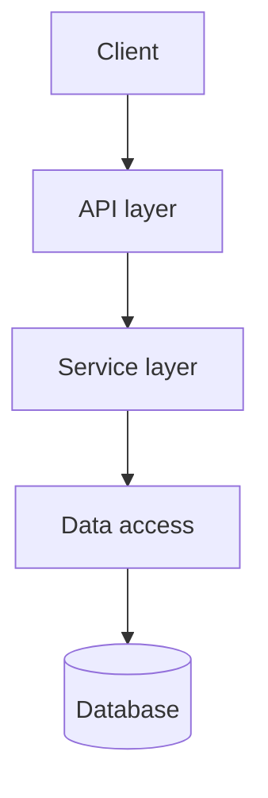
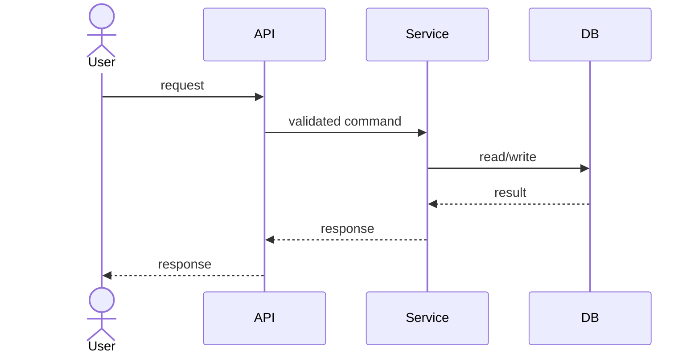

# Architecture

> **Current architecture** of the target project. Diagrams are the primary
> artifact; keep them in sync with reality.
> **Writer:** Claude (`knowledge-agent`/`architecture` skill). **Readers:**
> Claude, the executor (read-only).

<!-- This is a TEMPLATE. Replace the placeholder diagrams with the real system. -->

## System Overview

_One paragraph describing the high-level shape and the key boundaries._

## Component Map

| Component | Responsibility | Depends on |
|-----------|----------------|------------|
| _component_ | _what it owns_ | _its dependencies_ |

## Key Flows

_Describe the critical request/data flows._

## Cross-Cutting Concerns

- Auth, logging, error handling, caching, config — where each lives.

## Decisions

Significant structural choices are recorded as ADRs in
[decisions/](./decisions/). This file reflects the *current* architecture;
ADRs record *why* it is that way and what was rejected.

---

**Governance:** update on any architecture change and pair significant changes
with an ADR. See the governance policy in the Strix plugin `reference/docs/governance.md`.
