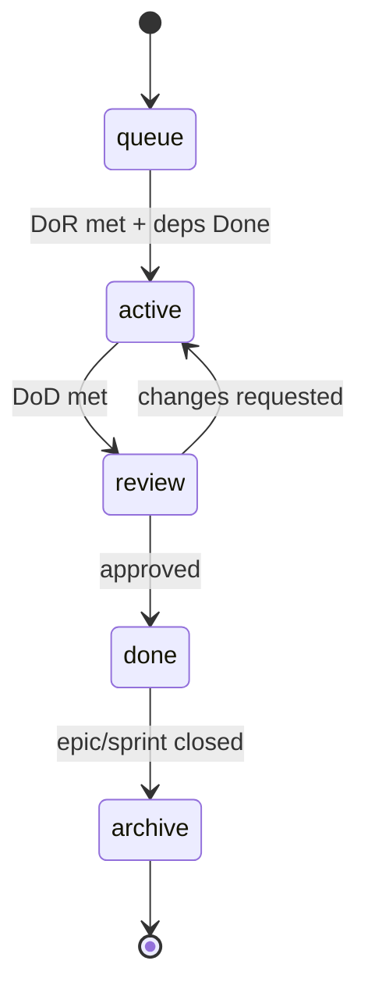

# Tasks

The Task Management Layer. The filesystem is the board: each lifecycle stage is
a directory, and a task file lives in exactly one of them at a time.

```text
tasks/
├── TEMPLATE.md      # the task contract (copy this)
├── queue/           # created, waiting (may be blocked by deps)
├── active/          # Cline is executing it
├── review/          # reviewer-agent is checking it
├── done/            # approved, merged, knowledge governed
└── archive/         # closed out on epic/sprint completion
```

## Lifecycle



Full detail: the Strix plugin's `reference/workflow/task-lifecycle.md`.

## Rules

- **Author:** Claude (`task-creator-agent`). Cline never creates tasks.
- **One directory = one status.** The `Status` field inside the file must match
  the directory. `reviewer-agent` treats a mismatch as a defect.
- **EPICs never enter `queue/` as a single executable task** — they are split
  into STANDARD tasks first, with dependencies.
- **Move, don't copy.** A task is a single file that travels between stages.

## Naming

`TASK-<ID>-<kebab-title>.md`, e.g. `TASK-014-add-login-rate-limit.md`.
IDs are sequential and never reused.

## Example

See the Strix plugin's `reference/examples/TASK-000-example.md` for a filled-in
STANDARD task.
