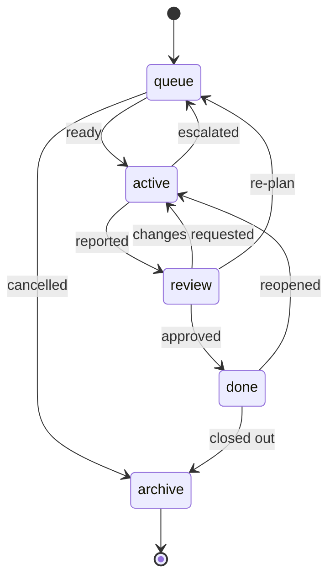

# Tasks

The Task Management Layer. The filesystem is the board: each lifecycle stage is
a directory, tasks are grouped by **workstream** inside it, and a task file lives
in exactly one place at a time.

<!-- strix:gen start id=board-layout -->
```
.strix/tasks/
├── workstreams.yaml
├── TEMPLATE.md
├── queue/
│   ├── billing-system/BILL-012-add-invoice-model.md  # one EPIC
│   ├── search-revamp/SRCH-004-reindex-nightly.md     # another, in parallel
│   └── general/TASK-030-fix-footer-typo.md           # belongs to no EPIC
├── active/
│   └── billing-system/BILL-011-add-invoice-api.md
├── review/
├── done/
└── archive/
```
<!-- strix:gen end id=board-layout -->

A **workstream** is one named line of work — normally one EPIC. Grouping by it is
what lets two people run unrelated efforts on one board without reading each
other's tasks. `workstreams.yaml` registers them; `general` is the reserved
bucket for work that belongs to no EPIC.

## Lifecycle

<!-- strix:gen start id=transition-diagram -->

<!-- strix:gen end id=transition-diagram -->

Only these moves are allowed; `strix-task move` enforces each gate and records
every move in the task's History. Anything else needs `--override "<reason>"`.

Full detail: the Strix plugin's `reference/workflow/task-lifecycle.md`.

## Rules

- **Author:** Claude (`task-creator-agent`). The executor never creates tasks.
- **Use the CLI.** `.strix/bin/strix-task` owns every change to this board —
  creating, moving, closing. Nothing should build a task path by hand.
- **One directory = one status.** The `Status` field inside the file must match
  the stage directory, and the `Workstream` field must match the parent
  directory. `reviewer-agent` treats a mismatch as a defect.
- **EPICs never enter `queue/` as a single executable task** — they are split
  into STANDARD tasks first, with dependencies, inside their own workstream.
- **Move, don't copy.** A task is a single file that travels between stages.
- **Gates are enforced.** A task goes active only when it is ready (no
  placeholders, Definition of Ready ticked, dependencies Done), and goes to
  review only with a filled Execution Report. `--override "<reason>"` exists for
  the rare exception and is recorded in History.
- **Commits name their task.** Every commit for a task carries a
  `Strix-Task: <ID>` trailer, so `strix-task diff <ID>` can show exactly its work.

## Commands

```bash
.strix/bin/strix-task workstream add billing-system --prefix BILL --owner quan
.strix/bin/strix-task new billing-system --title "Add invoice model"
.strix/bin/strix-task new general --title "Fix footer typo" --lite   # TRIVIAL only
.strix/bin/strix-task check BILL-001        # ready to go active?
.strix/bin/strix-task next                  # queued tasks, ready first
.strix/bin/strix-task move BILL-001 active  # records Base
.strix/bin/strix-task note BILL-001 --section "Execution Report" --text "npm test: exit 0; abc123"
.strix/bin/strix-task move BILL-001 review
.strix/bin/strix-task diff BILL-001         # its Strix-Task commits since Base
.strix/bin/strix-task move BILL-001 queue --reason "needs an ADR"   # escalate
.strix/bin/strix-task where BILL-001
.strix/bin/strix-task ls --owner quan
.strix/bin/strix-task doctor                # checks every board invariant
```

## Naming

<!-- strix:gen start id=board-path -->
`.strix/tasks/{stage}/{workstream}/{id}-{slug}.md`
<!-- strix:gen end id=board-path -->

IDs are sequential **within their workstream** and never reused, e.g.
`queue/billing-system/BILL-014-add-login-rate-limit.md`. Each workstream counts
from 001 independently, so two people never coordinate ID allocation.

## Example

See the Strix plugin's `reference/examples/TASK-000-example.md` for a filled-in
STANDARD task.
