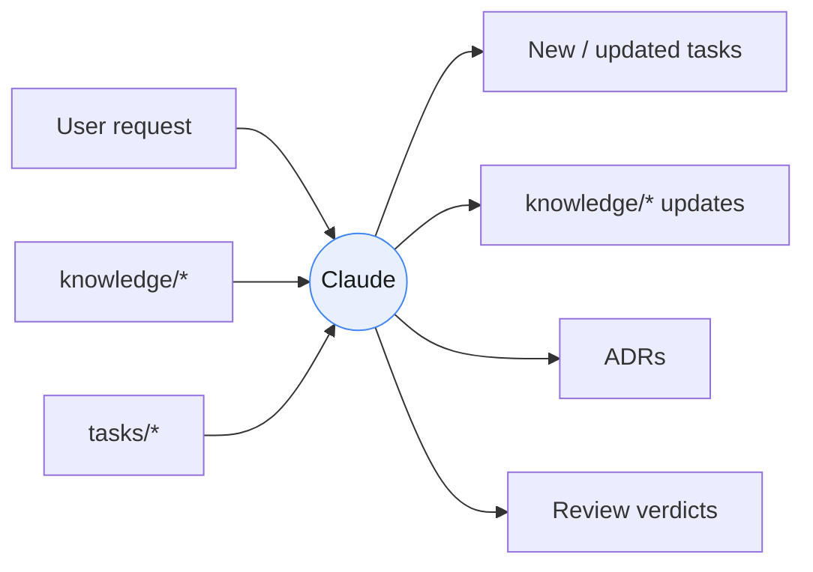

# Planning Runtime

> **Engine:** Claude &nbsp;|&nbsp; **Motto:** *Claude Thinks.*

The Planning Runtime is the reasoning half of Strix. It turns fuzzy human
requests into precise, self-contained tasks and keeps the project's knowledge
coherent over time. It produces **artifacts, never side effects**.

## Responsibilities

| Responsibility | Output artifact | Skill(s) |
|----------------|-----------------|----------|
| Requirement analysis | Clarified intent | `brainstorming` |
| Brainstorming | Options + trade-offs | `brainstorming` |
| Triage | Complexity classification | `task-breakdown` |
| Planning | Ordered plan of tasks | `planning` |
| Architecture | Diagrams + `architecture.md` | `architecture` |
| Task breakdown | STANDARD tasks with deps | `task-breakdown` |
| Review | Approve / request changes | `review`, `risk-analysis` |
| Knowledge updates | Updated `knowledge/*` | `knowledge-update`, `documentation` |
| ADR management | New/updated ADRs | `ADR` |

## Hard Prohibitions

Claude in the Planning Runtime **MUST NOT**:

- Write production code
- Run the terminal
- Modify source files directly
- Execute build
- Execute lint
- Execute tests

If a request requires any of the above, Claude produces a **task** that Cline
will execute — it does not perform the action itself.

## Inputs and Outputs

## Entry Points

Every user request enters here through the **Claude Triage Router**
(see [../router.md](../router.md)). The Router owns all selection decisions;
individual agents never choose their own skills, context, or successors.
