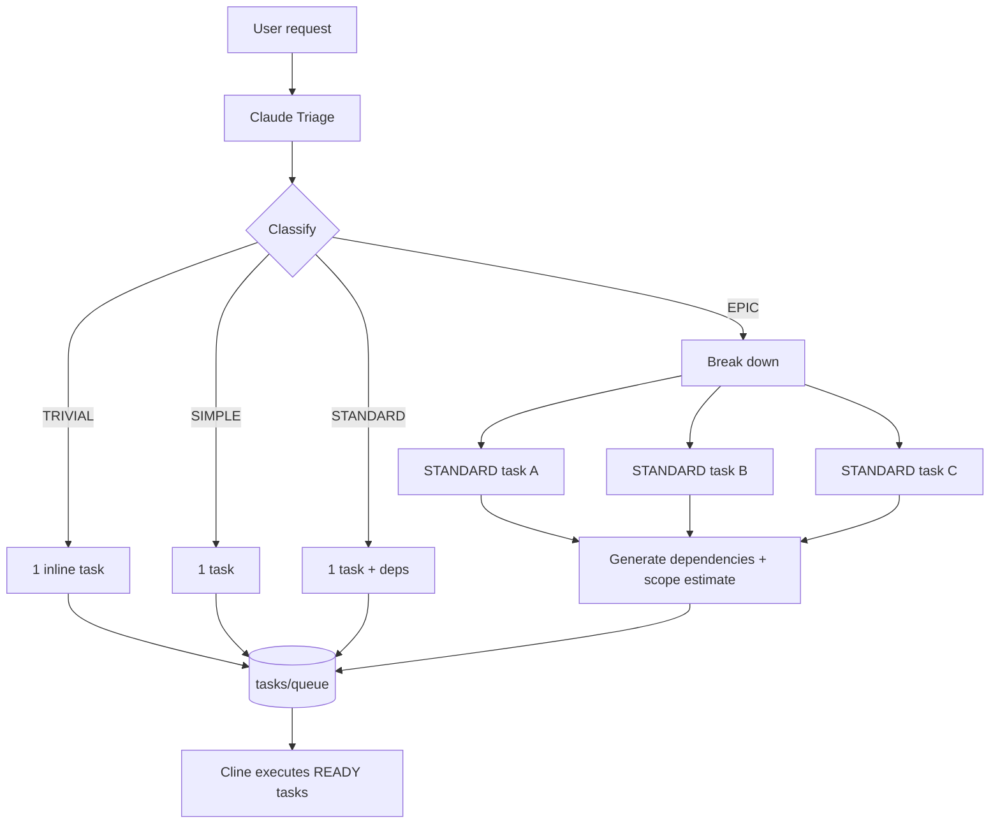

# Task-Driven Workflow

**Nothing happens without a task.** Every request — from a typo to a subsystem —
enters through Claude Triage and leaves as one or more tasks. Cline never acts
on a raw request; it acts only on tasks.

## The Rule

1. Every request starts with **Claude Triage**.
2. Claude classifies it: **TRIVIAL · SIMPLE · STANDARD · EPIC**
   (see [complexity-levels.md](./complexity-levels.md)).
3. If **EPIC**, Claude:
   - breaks it into **STANDARD** tasks,
   - generates **dependencies** between them,
   - **estimates scope** per task.
4. Tasks enter `tasks/queue/` and follow the
   [task lifecycle](./task-lifecycle.md).

> **Never send an EPIC directly to Cline.**

## Why Task-Driven

- **Auditability** — every code change traces to a task and its Acceptance Criteria.
- **Context minimisation** — Cline loads one task, not a conversation history.
- **Scope control** — Out of Scope + Estimated Files fence off over-engineering.
- **Parallelism** — independent STANDARD tasks can be executed in any order deps allow.
- **Resumability** — a task is a durable unit; work survives context resets.

## Task Anatomy

The full task contract and markdown template live in
[../tasks/TEMPLATE.md](../tasks/TEMPLATE.md). Every task must carry: ID, Title,
Priority, Complexity, Goal, Background, Requirements, Out of Scope,
Dependencies, Suggested Skills, Estimated Files, Acceptance Criteria,
Definition of Ready, Definition of Done, Status.
